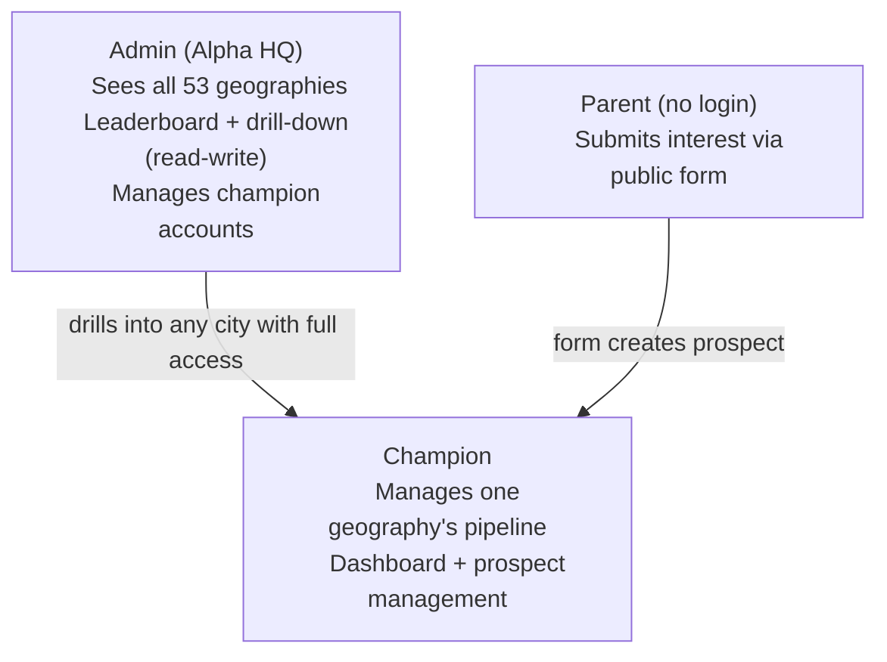

# Alpha School Enrollment CRM

## Problem Frame

Alpha School operates across 53 geographies. 23 have existing campuses; the remaining 30 need to reach 25 enrolled children to launch. Each geography has a champion — a local parent or organizer — who recruits families through personal outreach. Today there is no centralized system for champions to track their prospects, for parents to express interest, or for Alpha HQ to see enrollment progress across all cities. Champions rely on informal methods (spreadsheets, texts, memory), and there is no branded intake path for interested parents to enter their information.

The CRM gives champions a pipeline management tool, gives parents a branded way to sign up, and gives Alpha HQ visibility into the race to 25 across all geographies.

A "prospect" in this system is a family household — one parent record with an optional spouse and one or more children. The enrollment metric counts children, not families.

## User Roles

- **Admin**: Alpha HQ staff. Full read-write visibility across all 53 geographies. Can view and edit any geography's pipeline as the champion would. Manages champion accounts and geography assignments.
- **Champion**: Local organizer for one geography. Manages their own prospect pipeline. Cannot see other geographies.
- **Parent/Prospect**: No login. Enters information through a public intake form. Becomes a prospect record in the champion's pipeline.

## Requirements

**Public Intake Form**

- R1. Each geography has a unique URL (e.g., `/boston`, `/denver`) that champions can share directly with prospective parents.
- R2. The intake form includes a city selector so parents can switch geographies. Selecting a different geography updates the URL; the prospect is attributed to the selected geography's champion.
- R3. Submitting the form auto-creates a prospect record in the selected geography with status "Interested" and displays a branded confirmation message acknowledging receipt. If a record with the same email already exists in the selected geography, the existing record is updated rather than creating a duplicate. A parent may appear as a prospect in multiple geographies simultaneously.
- R4. The form collects: parent name, email, phone, spouse name, how they heard about Alpha (dropdown), and one or more children (name, grade, age, gender per child).
- R5. The form uses Alpha School branding (blue primary `#0000FF`, Archivo/Inter/Instrument Serif typography, clean modern design). Branding is geography-neutral — uses Alpha School colors and fonts from the v1 site, not Toronto-specific content or imagery.
- R6. The intake form displays a privacy notice and collects explicit consent before submission. A data retention policy governs how long prospect data is stored and provides a mechanism for data deletion on request.
- R7. The intake form includes CAPTCHA or equivalent bot protection and server-side rate limiting to prevent spam submissions.

**Prospect Data Model**

- R8. Each prospect record includes: parent name, email, phone, spouse name, how they heard about Alpha, geography, date added, commitment status, follow-up date, and a variable number of children.
- R9. Each child record includes: name, grade level, age, and gender.
- R10. Commitment status follows four pipeline stages with transition criteria:
  - **Interested**: Parent has expressed interest (via intake form or champion-added).
  - **Shadow Day**: Family has been scheduled for or completed a shadow day visit.
  - **Committed**: Family has made a verbal or written commitment to enroll.
  - **Enrolled**: Family has completed formal enrollment (deposit or registration).
- R11. Each prospect has a timestamped notes log where the champion can record interactions (e.g., "Called 4/15, very interested, scheduling shadow day").
- R12. Each prospect has a follow-up date field so champions can track next actions.

**Champion Dashboard**

- R13. On login, the champion sees a pipeline summary at the top: count of children at each stage (Interested, Shadow Day, Committed, Enrolled) with a visual progress bar toward the 25-child enrollment goal. Children at "Committed" and "Enrolled" stages both count toward the goal.
- R14. Below the pipeline summary, an activity feed shows recent signups and status changes.
- R15. The champion can navigate to a full prospect list with sort, filter, and search capabilities (e.g., filter by status, search by name, sort by follow-up date). From the list, the champion can view individual prospect details, update status, add notes, and set follow-up dates.
- R16. The champion can manually create prospect records directly from the dashboard, with the same fields as the intake form. This supports prospects sourced through personal outreach, phone calls, or community events.
- R17. The champion receives an email notification when a new prospect submits the intake form for their geography.
- R18. When a champion has zero prospects (first login or new geography), the dashboard shows a guided empty state with onboarding copy, a copy-link affordance for their geography's intake URL, and suggested next steps.

**Admin Dashboard**

- R19. The admin sees a leaderboard of all 53 geographies with progress bars toward the 25-child enrollment goal. Pre-launch geographies are grouped first, sorted by enrollment count descending. Existing campuses appear in a separate section below.
- R20. Each geography is seeded with a status of "pre-launch" or "existing campus." A pre-launch geography automatically promotes to "active campus" when it reaches the enrollment threshold.
- R21. The admin can click into any geography and has full read-write access: pipeline summary, activity feed, prospect list, and all champion actions (update status, add notes, set follow-up dates, create prospects).
- R22. The admin can create, deactivate, and reassign champion accounts. When a geography is reassigned to a new champion, all prospect data stays with the geography. When a champion is deactivated and no replacement is immediately assigned, new-signup notifications for that geography are routed to the admin until a new champion is assigned.

**Authentication**

- R23. Champions and admins log in with email-based authentication.
- R24. Champions see only their own geography on login. Admins see the cross-geography leaderboard.
- R25. All prospect read and write operations are server-side gated by geography: the authenticated user's assigned geography must match the prospect's geography. Admins are exempt.
- R26. Regardless of authentication mechanism chosen, sessions must expire after a defined idle period, credentials must never be stored in plaintext, and brute-force protection must be in place.

**Security & Data Integrity**

- R27. All intake form fields are validated and sanitized server-side: maximum lengths enforced, free-text fields stripped of HTML/script content, structured fields (grade, age, gender) validated against allowlists or ranges.
- R28. Admin geography drill-down events are written to an audit log (admin identity, geography accessed, timestamp).

## Success Criteria

- Within 4 weeks of launch, at least 75% of champions in pre-launch geographies are actively using the CRM (logged in within the past 7 days) rather than external tools.
- Interested parents in any geography can submit their information through a branded, city-specific intake form with a completion rate above 60%.
- Alpha HQ can see real-time enrollment progress across all 53 geographies and identify which cities are closest to launch and which need support.
- Average champion response time to new prospect signups is under 48 hours, enabled by email notifications.

## Scope Boundaries

- **In scope**: CRM for prospect pipeline management, public intake form, champion dashboard with prospect creation, admin leaderboard with read-write drill-down, user authentication, email notifications on new signup, privacy consent and data retention policy, champion account management.
- **Out of scope**: SMS outreach automation, payment processing, parent-facing portal (post-enrollment), scheduling/calendar for shadow days, mobile native app (responsive web is sufficient), integration with existing school management systems.

## Key Decisions

- **Full custom build over off-the-shelf**: Geography-specific intake URLs, the cross-geography leaderboard with drill-down, champion-to-geography access control, the "race to 25" progress tracking, and tight branding integration across the intake form are specific enough to justify a custom build. Off-the-shelf tools (Airtable, HubSpot) would require significant configuration for the multi-geography model and per-seat costs scale poorly across 53+ champions. Data control matters because the system stores children's PII across multiple jurisdictions.
- **Two roles only (Champion + Admin)**: No regional lead layer. Keeps the access model simple. Admin read-write drill-down covers the oversight need and handles champion absence.
- **Email notification on new signup**: Champions receive an email when a new prospect submits the intake form for their geography. Keeps champions engaged without requiring them to check the dashboard proactively.
- **All 53 geographies in the system**: Existing campuses can use the tool too, but UX is optimized for pre-launch geographies racing to 25. Pre-launch geographies are grouped first on the admin leaderboard.
- **Variable children per family**: No artificial cap on number of children per prospect.
- **Enrollment metric = children at Committed + Enrolled**: The 25-enrollment goal counts children (not families) at "Committed" or "Enrolled" status. A family with 3 enrolled children counts as 3 toward the goal.
- **CRM pipeline stages are independent of v1 site**: The CRM uses Interested/Shadow Day/Committed/Enrolled. The v1 marketing site uses its own status vocabulary (Exploring/Researching/Committed/Enrolled). These are separate systems and do not need to align.
- **Deduplicate within geography, allow cross-geography**: If a parent submits the intake form with an email that already exists in that geography, the existing record is updated. A parent may appear in multiple geographies simultaneously.
- **Pre-launch/existing distinction**: Seeded manually per geography, auto-promotes from pre-launch to active when enrollment threshold is reached.
- **Champion reassignment**: Admin can reassign a geography to a new champion. Prospect data stays with the geography, not the champion.

## Dependencies / Assumptions

- The 53 geographies and their champions are known and can be seeded into the system at launch.
- Alpha School v1 branding assets (colors, fonts) are available in the existing repo. The CRM uses geography-neutral Alpha School branding, not Toronto-specific content.
- The existing static site on GitHub Pages may need to coexist with or link to the CRM, but the CRM is a separate application.

## Outstanding Questions

### Resolve Before Planning

_(None — all product decisions resolved.)_

### Deferred to Planning

- [Affects R23][Technical] Authentication mechanism: managed auth service (e.g., Auth0, Supabase Auth, Firebase Auth) vs. custom email/password vs. magic links. (Email-based authentication is decided; the mechanism is open.)
- [Affects R1, R2][Technical] URL routing domain strategy: geography-specific URLs are required (R1); the open question is whether they live as subpaths on the existing domain or on a separate CRM domain.
- [Affects all][Technical] Tech stack selection: full-stack framework choice, database, hosting/deployment approach.
- [Affects R6][Needs research] Privacy/data retention compliance requirements across the 53 geographies (COPPA, PIPEDA, state privacy laws).

## Next Steps

-> `/ce:plan` for structured implementation planning
