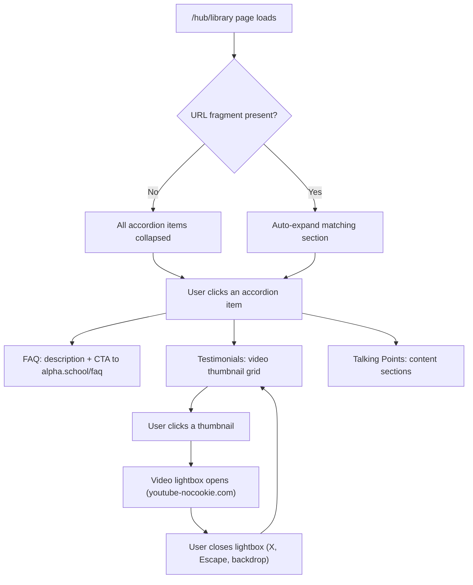

# Hub Library Page

## Problem Frame

Champions need reference materials to confidently talk about Alpha School with prospective parents. The Hub intro page promises three resource categories (FAQ Library, Parent Testimonials, "Why Alpha" Talking Points) that all link to `/hub/library`, which is currently a placeholder. The Library should consolidate these resources without duplicating content that already lives on alpha.school or YouTube.

## User Flow

## Requirements

**Layout & Navigation**

- R1. The Library page uses an accordion layout with 3 items: "FAQ Library", "Parent Testimonials", and "Why Alpha" Talking Points.
- R2. Only one accordion item is open at a time. Clicking a closed item opens it and closes the previously open item.
- R3. All accordion items start collapsed on page load unless a URL fragment is present (see R13).
- R4. The Library page renders inside the HubShell (sidebar + main panel) and remains accessible without authentication (outside the `(dashboard)` route group). The page calls `auth()` to obtain `isAuthenticated` for HubShell's sidebar state, following the same pattern as `src/app/hub/page.tsx` — unauthenticated users are not redirected. The existing placeholder at `src/app/hub/library/page.tsx` will be replaced.
- R13. When the page loads with a URL fragment (`#faq`, `#testimonials`, `#talking-points`), the corresponding accordion item auto-expands. The three resource cards on the Hub intro page link to `/hub/library#faq`, `/hub/library#testimonials`, and `/hub/library#talking-points` respectively.

**FAQ Library (Accordion Item 1)**

- R5. Displays a brief description of what the Alpha FAQ covers and a prominent CTA button/link that opens `https://alpha.school/faq/` in a new tab.
- R6. No FAQ content is duplicated on this page — the CTA is the primary interaction.

**Parent Testimonials (Accordion Item 2)**

- R7. Displays a responsive grid of video thumbnail cards based on the provided video list. Each card shows a thumbnail image and the video title.
- R8. Clicking a thumbnail opens a video lightbox with an embedded YouTube player. The lightbox closes via X button, Escape key, or backdrop click.
- R9. The video list (titles + YouTube URLs) will be provided as a text file in `/artifacts` during implementation.
- R10. See `artifacts/video-playback-screenshot.png` for visual reference. The lightbox approach is finalized during planning (see Outstanding Questions).

**"Why Alpha" Talking Points (Accordion Item 3)**

- R11. Displays the following talking point categories, each with a heading, brief explanation, and supporting detail:
  - **2-Hour Learning Model** — Students master academics in 2 hours/day using AI-powered personalized learning at their own pace
  - **AI-Powered 1:1 Learning** — Adaptive technology provides concept-based mastery with no knowledge gaps; students can advance beyond grade level
  - **Guides, Not Teachers** — Adults mentor, motivate, and coach rather than lecture and grade
  - **Life Skills & Entrepreneurship** — Afternoons devoted to financial literacy, public speaking, coding, cooking, entrepreneurship
  - **Physical & Mental Wellness** — Daily fitness, mindfulness, and emotional intelligence built into the schedule
  - **Community & Connection** — Small cohorts, mentors, culture of belonging
  - **Daily Schedule** — A tangible day-in-the-life walkthrough (Limitless Launch, Guided Academic Time, Lunch & Wellness, Life Skills & Enrichment)
  - **Outcomes** — SAT scores, national percentile ranking, graduates admitted to selective universities (statistics must be verified against current Alpha School system-wide data before implementation — see Dependencies)
  - **Student Experience** — Kids love school: freedom, self-pacing, motivation system
  - **Press & Validation** — Coverage in NYT, Forbes, WSJ, Today Show, Business Insider

- R12. All content is Alpha-generic — no references to specific campuses, locations, local events, enrollment forms, or community-specific details.

## Success Criteria

- A champion can open the Library, find a FAQ link, watch a parent testimonial video, and read through talking points in a single session without leaving the Hub (except for the FAQ link-out).
- The accordion layout feels natural and responsive on both desktop and mobile.
- Video lightbox works with keyboard (Escape to close) and is accessible (focus trap, aria-labels).

## Scope Boundaries

- **Not duplicating alpha.school/faq content** — link out only
- **Not building video upload/management** — videos are hardcoded from a provided list
- **Not building search or filtering** — 15 videos and 10 talking point sections don't need it
- **Not gating Library behind auth** — it stays open like today
- **Not building a CMS** — content is static in the component

## Key Decisions

- **Accordion over tabs**: Accordion lets each section take the full panel width when open, which works better for the video grid and long-form talking points. Only 3 items, so vertical stacking is natural.
- **Accordion over prototype's faceted filter grid**: The design prototype (`artifacts/design_handoff_champions_hub/prototype/library.jsx`) shows a filter+card layout with send-to-prospect actions and engagement metrics. This V1 intentionally simplifies to a three-section accordion. Send workflow and engagement tracking are future iteration candidates.
- **Lightbox for videos**: Keeps users on the Hub instead of bouncing to YouTube. Uses `youtube-nocookie.com` for privacy-enhanced embeds.
- **Link-out for FAQ**: Alpha School maintains their FAQ centrally. Duplicating would create drift.
- **All talking points included**: Use the full set from the research (2hr model through press coverage). Content updates post-launch require code changes; no CMS is planned.
- **Content sourced from alphasouthbayla.org**: Talking points are adapted from this site with all South Bay-specific content removed (events, forms, service areas, local enrollment details, campus-specific branding).

## Dependencies / Assumptions

- **Video list** (YouTube URLs + titles) will be provided by the user as a text file in `/artifacts` before implementation begins. If unavailable at implementation start, stub with placeholder cards so accordion structure is unblocked.
- YouTube embed via `youtube-nocookie.com` iframe (privacy-enhanced mode); iframe loads only when lightbox opens, not on page mount.
- Talking point content is adapted from public alphasouthbayla.org content, filtered for Alpha-generic messaging. Reference material also available in `artifacts/alpha_school_resource_library.md`.
- **Outcomes statistics** (SAT averages, percentile claims) must be verified against current Alpha School system-wide data, not individual campus data, before implementation.

## Outstanding Questions

### Deferred to Planning

- [Affects R7][Technical] Determine thumbnail strategy: use YouTube's auto-generated thumbnails (`img.youtube.com/vi/{id}/maxresdefault.jpg`) or custom images
- [Affects R8][Technical] Choose lightbox implementation: build a custom modal component or use an existing pattern from the codebase
- [Affects R11][Needs research] Decide on visual treatment for talking points — simple prose sections, cards, or illustrated blocks with icons

## Next Steps

-> `/ce:plan` for structured implementation planning
