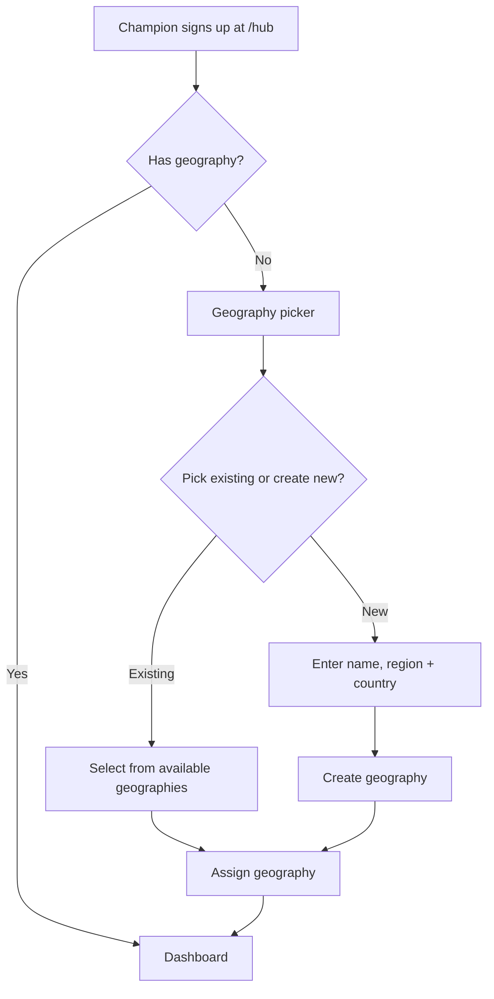

# Self-Service Geography Selection

## Problem Frame

Champions who sign up directly at `/hub` (rather than through the admin invite flow) land on a dead-end "Almost there!" screen because they have no geography assigned. With 54+ geographies and growing, the system needs to let champions pick their own geography at signup — and create new ones when theirs doesn't exist yet.

There is also an underlying data flow gap: `reassignGeography()` updates Supabase but not Clerk's `private_metadata`, so the Clerk session claims can fall out of sync with the actual geography assignment.

## Requirements

**Geography Selection Flow**
- R1. When an authenticated champion has no geography, show a geography picker instead of the "Almost there!" pending screen
- R2. The picker displays all existing geographies (54+ and growing) with a way to search or filter
- R3. The picker only shows geographies that do not already have an active champion (one champion per geography is enforced)
- R4. Champions can choose "new" to create a geography that doesn't exist yet
- R5. Creating a new geography requires name, region, and country (US or CA); slug is auto-generated

**Data Sync**
- R6. After selection (or creation + selection), assign the geography in both Supabase and Clerk `private_metadata` so session claims are correct without requiring re-login
- R7. Fix `reassignGeography()` to also update Clerk `private_metadata` when changing a champion's geography, closing the existing sync gap

**Implementation Constraints**
- R8. The geography creation server action must use the admin Supabase client (`getSupabaseAdminClient()`) to bypass RLS, since no INSERT policy exists on the geographies table for non-admin users

## Success Criteria
- A champion who signs up directly at `/hub` can pick or create a geography and land on their dashboard in one session, with no admin intervention
- Geography assignment stays in sync between Supabase and Clerk across all assignment paths (self-service, invite, admin reassign)

## Scope Boundaries
- Not changing the admin invite flow — it still works as-is
- Not adding geography switching after initial selection (champion contacts admin to reassign)
- Not adding admin approval for new geography creation — champions can self-serve

## Key Decisions
- **One champion per geography enforced**: The picker only shows available (unassigned) geographies. This preserves the existing data isolation model where each champion sees only their geography's prospect data
- **Champions can create geographies**: With 54+ and growing, it's impractical to pre-seed every possible location. New geographies default to `pre-launch` status
- **No re-login required**: Geography assignment updates Clerk metadata and refreshes the session so the user flows straight to their dashboard

## Dependencies / Assumptions
- Clerk API supports updating `private_metadata` and refreshing session tokens server-side
- The existing RLS policies on `geographies` only allow admin INSERT — the server action for creating new geographies will need to use the admin Supabase client

## Outstanding Questions

### Deferred to Planning
- [Affects R6][Technical] What is the best way to refresh Clerk session claims after updating `private_metadata` without forcing a full page reload or re-login?
- [Affects R5][Technical] Slug generation strategy — should handle collisions (e.g., two "Springfield" geographies in different states)
- [Affects R7][Technical] `reassignGeography()` nulls the old champion's Supabase geography but does not clear their Clerk `private_metadata` — both sides need updating
- [Affects R6][Technical] The Clerk webhook handler uses `private_metadata?.geography_id || null` on every `user.updated` event — if a non-geography update fires (e.g., name change), it may overwrite geography to null. The webhook should preserve existing geography when metadata is absent
- [Affects R4/R5][Technical] The `audit_log` table's `action` CHECK constraint needs new values (e.g., `geography-create`, `geography-select`) added via migration

## Next Steps
-> `/ce:plan` for structured implementation planning
