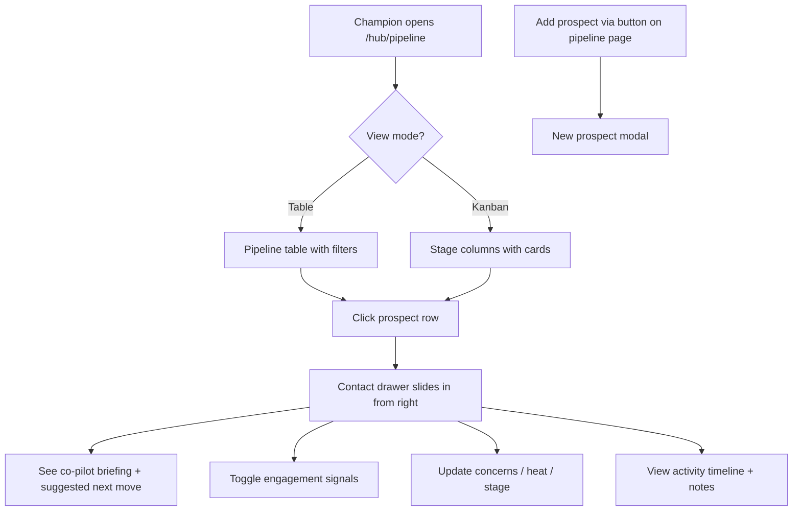

# Pipeline CRM for Champions

## Problem Frame

Champions are local advocates who guide prospective families through the interest cycle toward enrollment at Alpha School. Today they have a basic prospect list (`/hub/prospects`) with name, email, status, follow-up date, and notes. This is too thin to function as a real CRM — champions can't see at a glance which families are hot, which are going cold, what concerns are blocking progress, or what to do next.

The pipeline feature replaces the existing prospects section with a proper CRM at `/hub/pipeline` that gives champions the situational awareness they need to move families through stages — from "interested" through "shadow-day" and "committed" to "enrolled" — and a deterministic co-pilot that recommends next actions based on prospect data.

## User Flow

## Requirements

**Schema — New Prospect Fields**

- R1. Add `heat_score` (smallint 1-5, default 3) to prospects — measures engagement warmth. System auto-suggests based on engagement signals + recency of last touch + stage; champion can manually override.
- R2. Add `concerns` (text array, constrained to the set: "tuition", "pace", "accreditation", "screen-time", "socialization", "transcripts", "religion", "spouse-buy-in") to prospects. Values are selected from a predefined list in the UI, not free-text.
- R3. Add `engagement_signals` (text array, constrained to the set: "faq", "1-1", "intro", "deposit", "tour", "shadow") to prospects — tracks actions taken. UI labels: "Sent FAQ", "1:1 conversation", "Introduced to parent", "Shared deposit link", "Toured campus", "Booked shadow day".
- R4. Add `last_touch_at` (timestamptz) to prospects — updated on: note added, status changed, engagement signal toggled, concern updated. Implementation: application-level update in each server action (not a database trigger) to keep mutation paths explicit and auditable.
- R5. Add `neighborhood` (text, nullable) to prospects — sub-geography area for filtering (e.g., "Port Credit", "Streetsville"). Entered by champion when adding or editing a prospect.

**Schema — Library Items Table (schema only, no UI)**

- R6. Create `library_items` table with columns: id (uuid), type (text: "faq", "quote", "talking", "data"), title (text), body (text), concern (text, nullable — matches concerns enum), helpfulness_score (smallint, default 0), send_count (int, default 0), geography_id (uuid, nullable — null = global), created_at, updated_at. Seed with a starter set of items covering each concern so the co-pilot has data from day one.
- R7. Create `library_sends` table with columns: id (uuid), library_item_id (uuid FK), prospect_id (uuid FK), champion_id (uuid FK), channel (text), sent_at (timestamptz). This enables the co-pilot rules to check what has been sent to a prospect.

**Pipeline Table View**

- R8. Pipeline page lives inside the `(dashboard)/(champion)` route group to inherit auth guards, dashboard layout, and role-based routing. The sidebar "Pipeline" link and the dashboard header nav link both point to `/hub/pipeline`. Redirect `/hub/prospects` and `/prospects` to `/hub/pipeline`. Remove old prospect pages and routes.
- R9. Table columns: Family (initials avatar + parent name + kids count), Stage (colored pill), Heat (1-5 bar pips in coral), Neighborhood, Concerns (chip row, max 2 visible + "+N"), Last Touch (color-coded: green <=7 days, yellow 8-14 days, red >14 days), Next Action (text from `deriveNextMove` — same function used in co-pilot).
- R10. Stage filter pills above table — "All" plus one pill per stage showing count. Counts reflect current active filters (cross-filtered with neighborhood).
- R11. Neighborhood filter pills — "All" plus one per neighborhood. Prospects with no neighborhood set appear under "All" only.
- R12. "Add Prospect" button opens a modal overlay on the pipeline page. Required fields: parent first name, parent last name. Optional fields: email, phone, spouse name, neighborhood, source. Heat defaults to 3, concerns and signals default to empty. On save, modal closes and table refreshes.

**Kanban View**

- R13. Toggle between table and kanban views. Persist the preference per user.
- R14. Kanban shows 4 active columns (interested, shadow-day, committed, enrolled). Lost prospects are hidden from kanban — visible only in table view via stage filter. Each card shows: name, "X kids - neighborhood", heat pip, last touch. Column headers show count. Drag-and-drop between columns changes stage (validated against `ALLOWED_TRANSITIONS` from `src/lib/constants/pipeline.ts` — invalid drops are rejected with a brief toast).

**Contact Drawer**

- R15. Clicking a prospect row updates the URL to `/hub/pipeline?prospect={id}` and opens a 920px right-side slide-out drawer. Browser back closes the drawer. Refresh re-opens it. On mobile (<768px), the drawer becomes a full-screen sheet. Redirect `/hub/prospects/{id}` to `/hub/pipeline?prospect={id}` to preserve existing bookmarks.
- R16. Drawer header: prospect name, kids string, neighborhood, stage selector (dropdown constrained to ALLOWED_TRANSITIONS from current stage), heat display (clickable 1-5 pips for manual override), last-touch chip, action buttons (Call, Log activity). "Send from library" button is hidden until the library UI ships.
- R17. Drawer body: co-pilot block at the top, then activity timeline below. Activity timeline merges notes + status_history into a single chronological feed with colored dots by event type (note: blue, status change: purple, signal toggle: green).
- R18. Aside (right rail, 360px on desktop; stacks below timeline on mobile): About section (contact info, edit inline), Engagement signals (2-column toggle grid — each signal is a pill that fills when active, persists immediately via server action), Concerns (tag chips from predefined set — tap to add from dropdown, X to remove), Heat score (auto-suggested value with manual 1-5 pip override), Private notes (italic editorial font, add via text input).

**Conversation Co-pilot**

- R19. Co-pilot block appears at the top of the contact drawer, styled as an indigo gradient card (alpha-blue to alpha-blue-700, white text). Badge: "Conversation Co-pilot" with pulsing dot.
- R20. Co-pilot is fully deterministic (rules-based, no LLM). It synthesizes a briefing from prospect data: days since last touch, primary concern (first in the concerns array), heat score (the stored value, whether auto-suggested or manually overridden), and stage.
- R21. Co-pilot displays: summary text in serif italic, "Suggested next move" pill with sparkle icon, and a 3-card row of suggested library items matched by concern. If no library items exist yet, the suggested items row is hidden and the co-pilot shows only the summary + next move.
- R22. `deriveNextMove` rules function (pure function, first match wins):
    1. `stage === "lost"` — "This prospect is in lost status. No action needed."
    2. `daysSince > 21 && heat <= 2` — "21 days cold + low heat. One last public-event invite, then move to lost."
    3. `concerns.includes("tuition") && !hasSentLibraryItem(prospect, "tuition")` — "Send 'Three things to say to the tuition-skeptic spouse'." (`hasSentLibraryItem` checks `library_sends` for any item whose `concern` matches; the quoted text is the recommendation message shown to the champion.)
    4. `stage === "interested" && heat >= 4 && daysSince > 5` — "Hot + cooling. Suggest a coffee or a shadow day."
    5. `stage === "shadow-day"` — "Confirm shadow-day logistics within 48h."
    6. `stage === "committed"` — "Loop into the depositors thread, send onboarding doc."
    7. fallback — "Check in with a personalized note."
- R23. Suggested items algorithm: filter library_items where `item.concern` matches any of the prospect's concerns, sort by `helpfulness_score * 2 + send_count` descending, take top 3. If fewer than 3 matches, backfill with top library items by send_count globally.

**Engagement Signals**

- R24. Signals are toggleable from the contact drawer aside and persist immediately via server action. Server action validates: caller has champion role via Clerk session, prospect belongs to caller's geography.
- R25. Signal set (stored as short IDs, displayed as labels):

| ID | Label |
|----|-------|
| faq | Sent FAQ |
| 1-1 | 1:1 conversation |
| intro | Introduced to parent |
| deposit | Shared deposit link |
| tour | Toured campus |
| shadow | Booked shadow day |

**Visual Design**

- R26. Use existing Tailwind 4 theme tokens from `src/app/globals.css` — no new color values. Heat pips are coral, stage pills use existing STAGE_COLORS, co-pilot card uses alpha-blue gradient.
- R27. Typography: Archivo for display, Inter for body, Instrument Serif for italic accents (co-pilot summary, quotes)

**Access Control**

- R28. All new server actions (signal toggle, concern update, heat update, prospect create, prospect read) must validate Clerk champion session and geography match. RLS policies on prospects table apply to new columns automatically. Heat score, concerns, engagement signals, and private notes must never be exposed in any response accessible to non-champion roles.
- R29. Text inputs (notes, prospect names) must have maximum length bounds and be treated as untrusted input server-side.

**Empty States**

- R30. Pipeline table with zero prospects: illustration + "Add your first prospect" CTA pointing to the Add Prospect modal.
- R31. Filtered table with no results: "No prospects match these filters" with a "Clear filters" link.
- R32. Kanban column with zero cards: subtle dashed outline with stage name, no other content.
- R33. Co-pilot with insufficient data (new prospect, no concerns, no signals): summary shows "New prospect — update concerns and signals to get recommendations." Next move pill and suggested items are hidden.
- R34. Activity timeline with no entries: "No activity yet. Add a note or update this prospect to start the timeline."

## Success Criteria

- A champion can open `/hub/pipeline`, see all their prospects with heat/stage/concerns/last-touch at a glance, and quickly identify who needs attention
- Clicking a prospect opens the drawer with a co-pilot recommendation that is immediately actionable — the champion doesn't have to think about what to do next
- Stage transitions, signal toggles, concern updates, and heat changes persist without page reload
- The kanban view lets power users manage prospects by stage visually
- The pipeline replaces `/hub/prospects` entirely — one entry point, no confusion
- Opening a prospect via URL (`/hub/pipeline?prospect={id}`) works as a deep link

## Scope Boundaries

- **No LLM-powered co-pilot** — v1 is fully rules-based and deterministic
- **No library UI** — the `library_items` and `library_sends` tables are created for the co-pilot to query, but the full `/hub/library` page, send composer, and library management UI are a separate effort
- **No dashboard reshape** — KPI strip, thermometer, and Today's Briefing are separate from this work
- **No page builder** — Phase 5, separate effort
- **No events page** — separate effort
- **No prospect notifications** — privacy contract: prospects added manually are private notes, never notified
- **No cross-geography visibility** — champions see only their own geography's prospects
- **No leaderboard** — explicitly cut from design

## Key Decisions

- **Pipeline replaces prospects**: `/hub/pipeline` becomes the single CRM view inside the `(dashboard)/(champion)` route group. Existing `/hub/prospects` routes are removed and redirected. Data-fetching and server action patterns from the existing prospects code are reused.
- **Slide-out drawer with URL state**: Prospect detail is a 920px drawer driven by URL search param (`?prospect={id}`). Deep-linkable, survives refresh, browser back closes it.
- **Library tables in scope, library UI deferred**: `library_items` and `library_sends` tables are created and seeded so the co-pilot has data to work with. The library page and send composer ship separately.
- **Heat auto-suggested, manually overridable**: System suggests heat from engagement signals + recency + stage. Champions can override with a manual 1-5 selector.
- **Concerns and signals are constrained sets**: Values come from predefined enums, not free-text. This ensures co-pilot rules can reliably match.
- **last_touch_at updated in application code**: Each server action explicitly updates last_touch_at rather than using a database trigger, keeping mutation paths visible and auditable.

## Dependencies / Assumptions

- Schema migration (R1-R7) must run before pipeline UI work begins
- Existing Clerk auth and Supabase RLS geography scoping continue to work as-is — RLS applies to new columns automatically
- The existing `@tanstack/react-table` setup in `prospect-table.tsx` is extended, not replaced
- Library items must be seeded with a starter dataset (covering each concern) for co-pilot to function at launch

## Outstanding Questions

### Deferred to Planning

- [Affects R8][Technical] Routing consolidation mechanics — update sidebar link target, dashboard header nav, and add redirect rules
- [Affects R13][Technical] Where to persist kanban/table view preference — local storage or cookie (user profile adds unnecessary complexity)
- [Affects R1][Needs research] Heat auto-suggestion algorithm — which signals/recency/stage factors map to which heat values
- [Affects R17][Technical] Activity timeline event types — confirm which mutations should generate timeline entries and their visual treatment
- [Affects R6][Technical] Library items seed data — what starter items to include per concern

## Next Steps

-> `/ce:plan` for structured implementation planning
