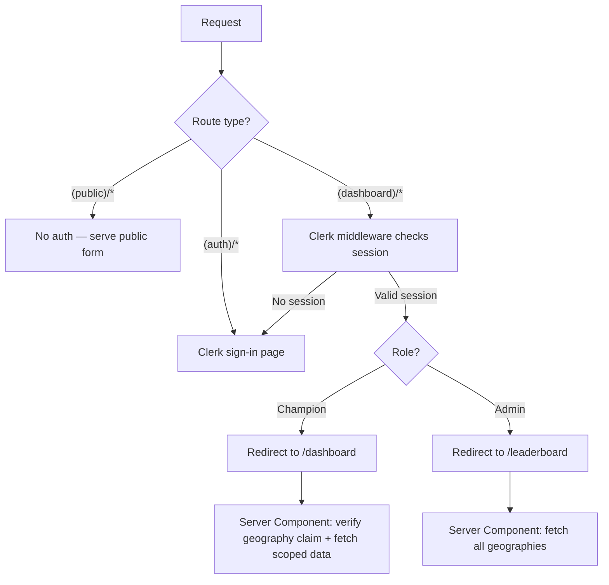
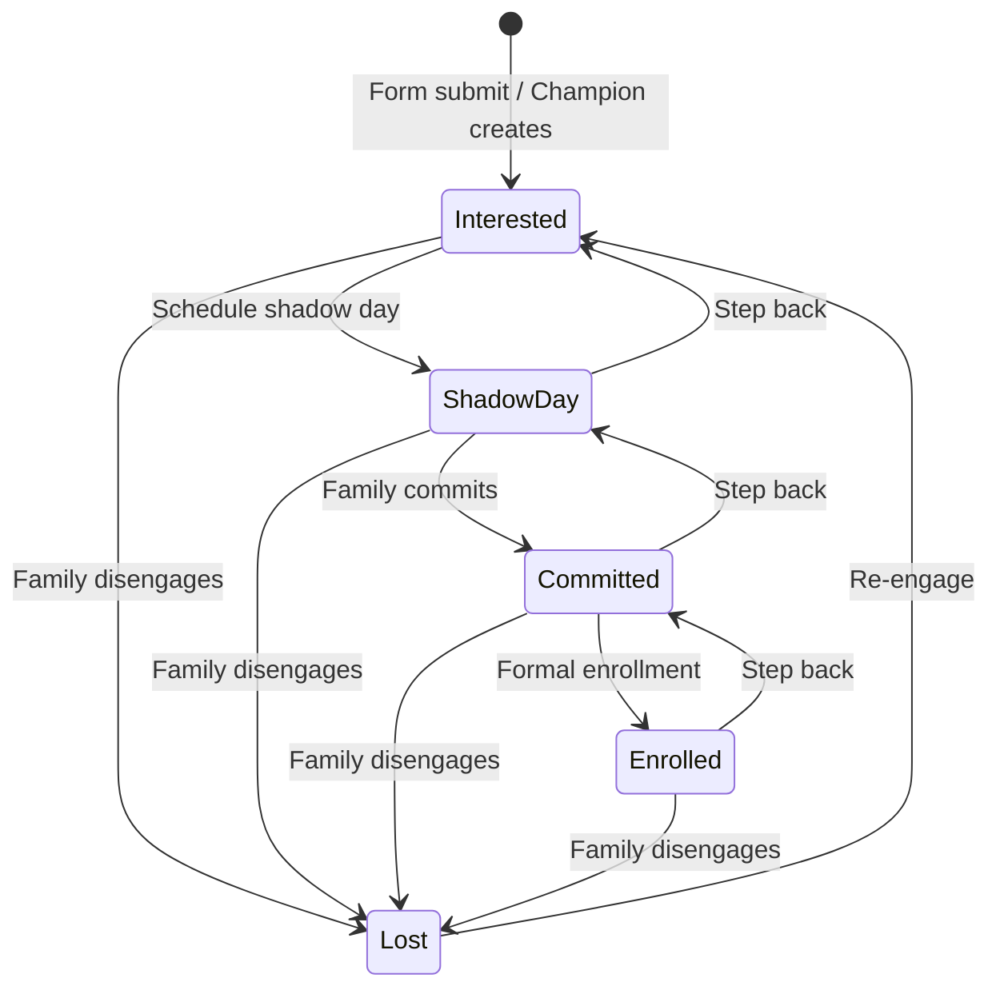
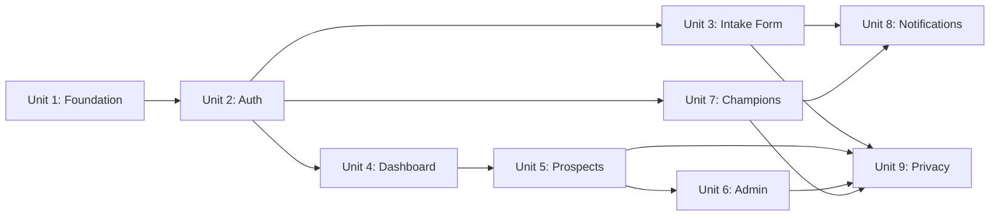

# Alpha School Enrollment CRM — Implementation Plan

## Overview

### Problem Frame

Alpha School operates across 53 geographies. 23 have existing campuses; 30 need to reach 25 enrolled children to launch. Champions (local parent organizers) recruit families through personal outreach but have no centralized system for pipeline management, and Alpha HQ has no cross-geography enrollment visibility. (See origin: `docs/brainstorms/2026-04-29-enrollment-crm-requirements.md`)

### Solution

A full custom CRM providing: a branded public intake form with geography-specific URLs, a champion dashboard for prospect pipeline management, and an admin leaderboard with drill-down into any geography. The CRM is a separate application from the existing static site.

### Scope

**In scope**: Public intake form, prospect pipeline management (Interested → Shadow Day → Committed → Enrolled → Lost), champion dashboard, admin leaderboard with read-write drill-down, email-based authentication with geography-scoped access, email notifications, privacy consent and data retention, champion account management, audit logging.

**Out of scope**: SMS automation, payment processing, parent-facing portal (post-enrollment), shadow day scheduling/calendar, mobile native app, integration with existing school management systems. (See origin: Scope Boundaries)

### Success Criteria

- 75%+ of champions in pre-launch geographies actively using the CRM (logged in within past 7 days) within 4 weeks of launch
- 60%+ intake form completion rate
- Real-time enrollment visibility across all 53 geographies for Alpha HQ
- Under 48-hour average champion response time to new prospect signups

## Requirements Trace

| Req | Description | Implementation Unit |
|-----|-------------|---------------------|
| R1 | Geography-specific intake URLs | Unit 3 |
| R2 | City selector with URL sync | Unit 3 |
| R3 | Auto-create prospect, dedup by email within geography | Unit 3 |
| R4 | Form fields: parent, email, phone, spouse, source, children | Unit 3 |
| R5 | Alpha School branding | Unit 1 |
| R6 | Privacy notice, consent, data retention, deletion | Units 3, 9 |
| R7 | CAPTCHA + rate limiting | Unit 3 |
| R8 | Prospect data model | Unit 1 |
| R9 | Child record fields | Unit 1 |
| R10 | Pipeline stages with transition criteria | Units 1, 5 |
| R11 | Timestamped notes log | Unit 5 |
| R12 | Follow-up date field | Unit 5 |
| R13 | Pipeline summary + progress bar toward 25 | Unit 4 |
| R14 | Activity feed | Unit 4 |
| R15 | Prospect list with sort, filter, search | Unit 5 |
| R16 | Champion manual prospect creation | Unit 5 |
| R17 | Email notification on new signup | Unit 8 |
| R18 | Guided empty state with copy-link | Unit 4 |
| R19 | Admin leaderboard with progress bars | Unit 6 |
| R20 | Geography pre-launch / existing campus status | Units 1, 6 |
| R21 | Admin read-write drill-down | Unit 6 |
| R22 | Champion account management + deactivation routing | Unit 7 |
| R23 | Email-based authentication | Unit 2 |
| R24 | Role-based routing on login | Unit 2 |
| R25 | Server-side geography-scoped access | Unit 2 |
| R26 | Session expiry, credential security, brute-force protection | Unit 2 |
| R27 | Server-side input validation and sanitization | Unit 3 |
| R28 | Audit logging for admin drill-down | Units 6, 9 |

## Key Decisions

### Carried from Origin

- **Full custom build over off-the-shelf**: Geography-specific intake URLs, cross-geography leaderboard, champion-to-geography access control, "race to 25" tracking, and branding integration justify custom build. Per-seat costs for 53+ champions make SaaS tools impractical. Children's PII across jurisdictions requires data control. (See origin: Key Decisions)
- **Two roles only (Champion + Admin)**: No regional lead layer. Admin drill-down covers oversight. (See origin: Key Decisions)
- **Enrollment metric = children at Committed + Enrolled**: A family with 3 children at Committed counts as 3 toward the 25-child goal. (See origin: Key Decisions)
- **Deduplicate within geography, allow cross-geography**: Same email in same geography updates existing record. Parent may exist in multiple geographies. (See origin: Key Decisions)
- **Pipeline stages independent of v1 site**: CRM uses Interested/Shadow Day/Committed/Enrolled. The v1 site uses Exploring/Researching/Committed/Enrolled. Separate systems. (See origin: Key Decisions)
- **Variable children per family**: No artificial cap, but a practical maximum of 15 per submission for spam defense alongside CAPTCHA. (See origin: Key Decisions)

### New Technical Decisions

**D1. Tech Stack: Next.js + Clerk + Supabase + Vercel**

| Layer | Choice | Rationale |
|-------|--------|-----------|
| Framework | Next.js 15 (App Router) | Best integration ecosystem for Clerk + Supabase + Vercel. Route groups cleanly separate public form from authenticated dashboard. Server Components for data-heavy views, Server Actions for mutations. React ecosystem for hiring/maintainability. |
| Auth | Clerk | Built-in RBAC with Organizations, pre-built UI components, first-class Next.js middleware, official Supabase JWT integration. Free tier: 50K MAU (55 users is permanently free). Geography-scoping via custom JWT claims. Chosen over Supabase Auth (requires building all UI and RBAC from scratch) and Auth0 (lower free tier, more configuration). |
| Database | Supabase Pro ($25/month) | Relational model fits prospect/children/notes structure. Row Level Security enforces geography scoping at the database layer — even buggy application code cannot leak cross-geography data. Pro tier required: SLA guarantee, daily backups, and Data Processing Agreement (DPA) for children's PII across jurisdictions. |
| Email | Resend | Free tier: 3K emails/month (volume is ~100-500/month). React Email integration for JSX-based templates. SendGrid eliminated its free tier in May 2025; Postmark costs $15/month minimum. |
| Bot Protection | Cloudflare Turnstile | Free forever, invisible by default (maximizes form completion rate), privacy-respecting (important given children's PII context). Works standalone without Cloudflare DNS. |
| Rate Limiting | Upstash Redis (free tier) | Token-bucket rate limiting for intake form submissions. Free tier: 10K commands/day, 256 MB. `@upstash/ratelimit` SDK provides a clean per-IP limiter with no infrastructure management. |
| Hosting | Vercel Pro ($20/month) | Native Next.js platform. Preview deployments per PR. Hobby tier prohibits commercial use per Vercel ToS — Pro is required for a production application. |
| UI | shadcn/ui + Tailwind CSS | shadcn/ui provides accessible, customizable components (tables, forms, dialogs, badges). Tailwind config mirrors existing design tokens from `css/colors-and-type.css`. |

Total monthly cost at launch: **~$45/month** (Supabase Pro $25 + Vercel Pro $20). All other services on free tiers.

**D2. URL Routing: Separate CRM domain**

The CRM lives on a separate domain or subdomain (e.g., `enroll.alphaschool.com`) deployed on Vercel. The existing static site stays on GitHub Pages. Geography-specific intake URLs are subpaths of the CRM domain: `enroll.alphaschool.com/boston`, `enroll.alphaschool.com/denver`. The exact domain is configured at deployment time. Rationale: GitHub Pages and Vercel are separate hosting platforms with different build/deploy pipelines. Subpath routing on the same domain would require a proxy or edge rewrite layer.

**D3. Lost Pipeline Stage**

Add a "Lost" terminal state accessible from any pipeline stage. Children at Lost are excluded from the enrollment count. Without this, the progress bar is permanently inflated when families disengage — the single biggest data integrity risk in the spec. Champions can move prospects backward through stages (e.g., Committed → Shadow Day) as well as to Lost.

**D4. Dedup Merge Semantics on Re-submission**

When a parent re-submits the intake form with an email that already exists in that geography:
- **Do not overwrite**: Contact fields (phone, spouse name, source) are NOT silently overwritten — overwriting destroys champion-verified data
- **Store for review**: Re-submitted values are stored in the activity feed metadata (e.g., `{ old_phone: "...", new_phone: "..." }`) so the champion can review and manually update if appropriate
- **Preserve**: Status, notes, follow-up date, and all champion-added data
- **Do not modify**: Existing child records (children are only added/edited by the champion)
- **Notify**: Flag the re-submission in the activity feed so the champion can review new information

This prevents form re-submissions from silently overwriting champion-verified information. The champion sees what changed and decides whether to update.

**D5. Data Deletion Workflow**

Admin-initiated hard delete with cascading removal. Workflow: parent requests deletion (email to Alpha HQ) → admin locates prospect → confirms deletion → system performs cascading hard delete (prospect + children + notes + status history) → audit log records deletion event (who, when, prospect ID, geography) without retaining PII. Champions can also request admin perform deletion. No self-service deletion portal in v1.

**D6. Auto-promotion Threshold**

A pre-launch geography automatically promotes to "active campus" when it reaches 25 children at Committed + Enrolled status, matching R13's progress bar metric. No auto-demotion: if the count drops below 25 (due to withdrawals), admin can manually revert. Auto-demotion would create confusing oscillation on the leaderboard.

**D7. Expanded Audit Logging**

Extend beyond R28 (admin drill-down) to log all write operations on prospect records and champion accounts: status changes, prospect creation, prospect deletion, note additions, champion account creation/deactivation/reassignment. For a system storing children's PII across jurisdictions, the audit surface must be comprehensive.

**D8. Session Configuration**

8-hour idle timeout for champions (who may leave the dashboard open during phone outreach), 4-hour idle timeout for admins (who have broader access across all geographies). Configurable via Clerk session settings.

**D9. Concurrent Editing Strategy**

Last-write-wins with `updated_at` optimistic concurrency. When an admin and champion edit the same prospect simultaneously, the second write detects a stale `updated_at` timestamp and prompts the user to reload before saving. Simple and appropriate for the scale (53 geographies, low concurrent edit probability per prospect).

**D10. Activity Feed Parameters**

30-day rolling window, paginated (20 items per page). Includes signups, status changes, note additions, and admin drill-down actions within the geography.

**D11. Notification Content**

New prospect email includes: parent first name only (no last name, no email, no prospect UUID), child count, geography name, and a link to the geography's prospect list page (not a deep-link to a specific prospect). Minimizing PII in email reduces exposure if a champion's inbox is compromised. The champion clicks through to the dashboard to see full details.

**D12. Secrets Management**

All secrets are stored as Vercel environment variables, scoped by environment:
- **Production**: `CLERK_SECRET_KEY`, `SUPABASE_SERVICE_ROLE_KEY`, `RESEND_API_KEY`, `CLERK_WEBHOOK_SECRET`, `UPSTASH_REDIS_REST_URL`, `UPSTASH_REDIS_REST_TOKEN`, `TURNSTILE_SECRET_KEY`
- **Preview**: Separate Clerk dev instance and Supabase project to prevent test data contamination. Preview deployments use development-scoped keys.
- **Local**: `.env.local` (git-ignored) with development keys. `.env.local.example` documents all required variables without values.

The Supabase service role key is used only in the Clerk webhook handler (`/api/webhooks/clerk/route.ts`) for profile sync — never in application-layer code. The public intake form uses a `SECURITY DEFINER` function called via the Supabase anon key.

## Technical Design

### Project Structure

The CRM lives in a `crm/` directory at the repo root, keeping it separate from the existing static site.

```
crm/
  src/
    app/
      layout.tsx                          # Root layout: providers, fonts, metadata
      (public)/
        [geography]/
          page.tsx                        # Public intake form
          confirmation/page.tsx           # Post-submission confirmation
      api/
        webhooks/
          clerk/route.ts                  # Clerk webhook → profiles sync
      (auth)/
        sign-in/[[...sign-in]]/page.tsx   # Clerk sign-in
      (dashboard)/
        layout.tsx                        # Authenticated layout: nav, sidebar
        (champion)/
          dashboard/page.tsx              # Pipeline summary + activity feed
          prospects/
            page.tsx                      # Prospect list (sort/filter/search)
            [id]/page.tsx                 # Prospect detail + notes + status
            new/page.tsx                  # Manual prospect creation
        (admin)/
          leaderboard/page.tsx            # 53-geography leaderboard
          geography/[geography]/
            page.tsx                      # Admin drill-down (reuses champion components)
          champions/page.tsx              # Champion account management
    lib/
      supabase/
        client.ts                         # Browser client (singleton)
        server.ts                         # Per-request server client
        admin.ts                          # Service role client (webhook handler only)
      actions/
        intake.ts                         # Public form submission
        prospects.ts                      # Prospect CRUD + status transitions
        champions.ts                      # Champion account management
        notifications.ts                  # Email notification dispatch
      validations/
        intake-schema.ts                  # Zod schema for intake form
        prospect-schema.ts                # Zod schema for prospect updates
      constants/
        pipeline.ts                       # Stage definitions, colors, transitions
        geographies.ts                    # Geography metadata
    components/
      ui/                                 # shadcn/ui primitives
      dashboard/
        pipeline-summary.tsx              # Stage counts + progress bar
        activity-feed.tsx                 # Recent events list
        prospect-table.tsx                # Sortable/filterable data table
        prospect-detail.tsx               # Full prospect view
        notes-log.tsx                     # Timestamped notes
        empty-state.tsx                   # First-login onboarding
        copy-link-button.tsx              # Persistent intake URL copy
      admin/
        leaderboard-grid.tsx              # Geography progress cards
        champion-manager.tsx              # Champion CRUD UI
      intake/
        intake-form.tsx                   # Client Component: form with validation
        city-selector.tsx                 # Geography dropdown + URL sync
        child-fields.tsx                  # Dynamic add/remove child rows
        turnstile-widget.tsx              # Cloudflare Turnstile wrapper
      shared/
        progress-bar.tsx                  # Reusable 25-child progress indicator
        status-badge.tsx                  # Pipeline stage badge (color-coded)
      emails/
        new-prospect-email.tsx            # React Email template
    types/
      database.ts                         # Generated from Supabase schema
  supabase/
    migrations/
      001_initial_schema.sql              # All tables, indexes, constraints
      002_seed_geographies.sql            # 53 geographies with status
      003_rls_policies.sql                # Row Level Security
      004_intake_function.sql             # SECURITY DEFINER intake function
    config.toml                           # Supabase project config
  package.json
  tsconfig.json
  next.config.ts
  tailwind.config.ts
  middleware.ts                           # Clerk route protection
  .env.local.example                     # Documented env var template
```

### Database Schema

```
geographies
  id              uuid PK
  slug            text UNIQUE NOT NULL        -- "boston", "denver"
  name            text NOT NULL               -- "Boston", "Denver"
  region          text                        -- "Northeast", "West"
  country         text NOT NULL               -- "US", "CA"
  status          text NOT NULL DEFAULT 'pre-launch'  -- "pre-launch" | "existing-campus" | "active-campus"
  enrollment_threshold  int NOT NULL DEFAULT 25
  created_at      timestamptz NOT NULL DEFAULT now()
  updated_at      timestamptz NOT NULL DEFAULT now()

profiles (synced from Clerk)
  id              uuid PK
  clerk_user_id   text UNIQUE NOT NULL
  email           text NOT NULL
  full_name       text NOT NULL
  role            text NOT NULL               -- "admin" | "champion"
  geography_id    uuid FK → geographies       -- NULL for admins
  is_active       boolean NOT NULL DEFAULT true
  created_at      timestamptz NOT NULL DEFAULT now()
  updated_at      timestamptz NOT NULL DEFAULT now()

  UNIQUE (geography_id) WHERE is_active = true AND role = 'champion'

prospects
  id              uuid PK
  geography_id    uuid FK → geographies NOT NULL
  parent_first    text NOT NULL
  parent_last     text NOT NULL
  parent_email    text NOT NULL
  parent_phone    text
  spouse_name     text
  source          text                        -- "how heard about Alpha" value
  status          text NOT NULL DEFAULT 'interested'
    -- "interested" | "shadow-day" | "committed" | "enrolled" | "lost"
  follow_up_date  date
  first_responded_at  timestamptz           -- set when champion first opens or acts on prospect; measures 48-hour response SLA
  consent_given   boolean NOT NULL DEFAULT false
  consent_at      timestamptz
  created_at      timestamptz NOT NULL DEFAULT now()
  updated_at      timestamptz NOT NULL DEFAULT now()

  UNIQUE (geography_id, parent_email)         -- dedup within geography

children
  id              uuid PK
  prospect_id     uuid FK → prospects NOT NULL (CASCADE DELETE)
  geography_id    uuid FK → geographies NOT NULL  -- denormalized for RLS (avoids JOIN to prospects on every row-level check)
  first_name      text NOT NULL
  grade           text
  age             int CHECK (age BETWEEN 2 AND 19)
  gender          text
  created_at      timestamptz NOT NULL DEFAULT now()

notes
  id              uuid PK
  prospect_id     uuid FK → prospects NOT NULL (CASCADE DELETE)
  geography_id    uuid FK → geographies NOT NULL  -- denormalized for RLS
  author_id       uuid FK → profiles NOT NULL
  body            text NOT NULL
  created_at      timestamptz NOT NULL DEFAULT now()

status_history
  id              uuid PK
  prospect_id     uuid FK → prospects NOT NULL (CASCADE DELETE)
  geography_id    uuid FK → geographies NOT NULL  -- denormalized for RLS
  old_status      text NOT NULL
  new_status      text NOT NULL
  changed_by      uuid FK → profiles NOT NULL
  changed_at      timestamptz NOT NULL DEFAULT now()

audit_log
  id              uuid PK
  actor_id        uuid FK → profiles NOT NULL
  action          text NOT NULL               -- "drill-down" | "status-change" | "prospect-create" | "prospect-delete" | "note-add" | "champion-create" | "champion-deactivate" | "champion-reassign"
  geography_id    uuid FK → geographies
  prospect_id     uuid                        -- nullable, not FK (prospect may be deleted)
  metadata        jsonb                       -- action-specific details
  created_at      timestamptz NOT NULL DEFAULT now()
```

### Row Level Security Strategy

RLS is the primary access control enforcement, not just a safety net. **Fail-closed**: if JWT claims are missing or malformed, RLS policies must deny access (no fallback to permissive behavior).

- **prospects**: Champions can SELECT/INSERT/UPDATE rows where `geography_id` matches their JWT `geography_id` claim. Admins bypass geography filtering. Deletions are admin-only.
- **children, notes, status_history**: Same geography-scoped policies as prospects, using the denormalized `geography_id` column (avoids per-row JOIN to prospects for RLS evaluation).
- **geographies**: All authenticated users can SELECT. Only admins can UPDATE (for status changes).
- **profiles**: Admins can SELECT all. Champions can SELECT their own profile only.
- **audit_log**: INSERT for all authenticated users. SELECT: admins can read all entries; champions can SELECT entries filtered by their `geography_id` (required for the activity feed in Unit 4). No UPDATE or DELETE for anyone — audit entries are immutable.
- **Public intake form**: Uses a `SECURITY DEFINER` Postgres function (e.g., `public.submit_intake(...)`) that runs with elevated privileges, bypassing RLS. The function has INSERT-only grants on `prospects` and `children` — it cannot read, update, or delete existing records. The Server Action validates the Turnstile token and applies rate limiting before calling this function. This avoids exposing the Supabase service role key to the application layer.

All RLS policy conditions use `(SELECT auth.jwt() ->> 'claim')` wrapped in a subquery for performance (avoids per-row re-evaluation).

### Authentication Flow



Clerk middleware protects all `(dashboard)` routes. Server Components re-verify auth via Clerk's `auth()` helper and extract role + geography_id from session claims before any data fetch. Server Actions re-verify auth before any mutation (Server Actions are directly POST-accessible).

**Clerk JWT Templates (replaces custom claims hook)**: Configure a Supabase-compatible JWT template in the Clerk dashboard that injects `role` and `geography_id` into the JWT payload. These values are sourced from Clerk `privateMetadata` (not `publicMetadata`, which is user-writable and would allow privilege escalation). Supabase RLS reads these claims via `auth.jwt() ->> 'role'` and `auth.jwt() ->> 'geography_id'`.

**Clerk → Supabase profile sync**: A webhook endpoint (`/api/webhooks/clerk`) receives `user.created` and `user.updated` events from Clerk and upserts the corresponding row in the `profiles` table. This keeps Supabase profile data (name, email, role, geography_id, is_active) synchronized with Clerk as the source of truth. The webhook verifies the Svix signature before processing.

**JWT lifetime and refresh**: Clerk JWTs have a short lifetime (60 seconds default). When a champion is reassigned to a different geography, the admin action updates Clerk `privateMetadata` with the new `geography_id`. The old JWT expires within 60 seconds, and the next request issues a fresh JWT with the updated claim. No forced logout or manual token invalidation is required.

**Admin drill-down geography validation**: When an admin drills into a geography via `/geography/[geography]`, the Server Component validates the geography slug against the `geographies` table before rendering. Invalid or nonexistent slugs return 404, preventing enumeration attacks.

### Pipeline Stage Transitions



Forward transitions, backward transitions (one step back), and withdrawal from any stage are all supported. Re-engagement from Lost returns to Interested. Every transition is recorded in `status_history` and the `audit_log`.

**Status transition UI**: The prospect detail page shows a dropdown (or button group) with only the valid next states for the current status. This prevents invalid transitions at the UI layer, complementing the server-side validation. For example, an "Interested" prospect shows buttons for "Shadow Day" and "Lost" only — not "Committed" or "Enrolled".

**Enrollment metric vs family-level status (v1 simplification)**: Status is set per prospect (family), but the enrollment metric counts children. This means all children in a family share the same pipeline status. If one child in a family of three withdraws, the champion marks the whole prospect as "Lost" and creates a new prospect for the remaining children, or keeps the prospect at its current status with a note. This is a known v1 simplification — per-child status tracking is deferred.

### Color Mapping (from existing design tokens)

| Stage | Token | Hex |
|-------|-------|-----|
| Interested | `--ink-3` | `#4A4A55` |
| Shadow Day | `--alpha-blue` | `#0000FF` |
| Committed | `--alpha-sun` | `#FFD24A` (text: `--warning` `#B85C00`) |
| Enrolled | `--success` | `#0E8A5F` |
| Lost | `--danger` | `#C41E3A` |

These map to the existing v1 status badge pattern in `css/page.css`, adapted for the CRM's stage names.

## Implementation Units

### Unit 1: Project Foundation & Design System
`[ ]`

**Goal**: Scaffold the Next.js project, configure the design system from existing brand tokens, set up Supabase schema with all tables and seed data.

**Files**:
- `crm/package.json`
- `crm/tsconfig.json`
- `crm/next.config.ts`
- `crm/tailwind.config.ts` — design tokens ported from `css/colors-and-type.css`
- `crm/src/app/layout.tsx` — root layout with Archivo/Inter/Instrument Serif font loading
- `crm/src/app/globals.css` — Tailwind base + custom properties
- `crm/src/lib/constants/pipeline.ts` — stage definitions, colors, allowed transitions
- `crm/src/lib/constants/geographies.ts` — geography metadata type
- `crm/src/components/shared/status-badge.tsx`
- `crm/src/components/shared/progress-bar.tsx`
- `crm/supabase/migrations/001_initial_schema.sql` — all tables, indexes, constraints
- `crm/supabase/migrations/002_seed_geographies.sql` — 53 geographies
- `crm/src/lib/supabase/client.ts`
- `crm/src/lib/supabase/server.ts`
- `crm/src/types/database.ts` — generated types

**Test scenarios**:
- `crm/src/__tests__/constants/pipeline.test.ts`
  - Pipeline stages include all 5 statuses (interested, shadow-day, committed, enrolled, lost)
  - Allowed transitions match the state diagram (forward, backward one step, any → lost, lost → interested)
  - Enrollment count stages are exactly [committed, enrolled] — lost is excluded
- `crm/src/__tests__/components/status-badge.test.tsx`
  - Each stage renders with the correct color token
  - Lost badge uses danger color
- `crm/src/__tests__/components/progress-bar.test.tsx`
  - Progress bar shows correct percentage (e.g., 10/25 = 40%)
  - Bar caps at 100% when count exceeds 25
  - Zero prospects shows empty bar with "0 / 25" label

**Key pattern**: Port design tokens from `css/colors-and-type.css` into `tailwind.config.ts` `theme.extend` — do not duplicate values, reference the existing file as the source of truth for color hex codes, font families, spacing scale, and border radii.

---

### Unit 2: Authentication & Authorization
`[ ]`

**Depends on**: Unit 1

**Goal**: Integrate Clerk for email login, connect Clerk JWTs to Supabase RLS, implement role-based routing.

**Files**:
- `crm/middleware.ts` — Clerk middleware protecting `(dashboard)` routes
- `crm/src/app/(auth)/sign-in/[[...sign-in]]/page.tsx` — Clerk `<SignIn>` with Alpha branding
- `crm/src/app/(dashboard)/layout.tsx` — authenticated layout with nav, role-based sidebar
- `crm/src/lib/supabase/admin.ts` — service role client (used only for profile sync webhook, never exposed to application layer)
- `crm/supabase/migrations/003_rls_policies.sql` — all RLS policies
- `crm/supabase/migrations/004_intake_function.sql` — `SECURITY DEFINER` function `public.submit_intake(...)` with INSERT-only grants on prospects and children
- `crm/src/app/api/webhooks/clerk/route.ts` — Clerk webhook handler for `user.created`/`user.updated` → profiles table sync (verifies Svix signature)
- `crm/.env.local.example` — documented env var template (Clerk keys, Supabase URL/anon key, Resend key, Turnstile keys, Upstash Redis URL/token, Clerk webhook signing secret)

**Test scenarios**:
- `crm/src/__tests__/middleware.test.ts`
  - Unauthenticated requests to `/dashboard/*` redirect to `/sign-in`
  - Unauthenticated requests to `/boston` (public form) pass through
  - Authenticated champion redirected from `/leaderboard` to `/dashboard`
  - Authenticated admin can access both `/leaderboard` and `/dashboard`
- `crm/src/__tests__/lib/supabase/rls.test.ts` (integration test against Supabase)
  - Champion can read prospects in their geography
  - Champion cannot read prospects in another geography
  - Admin can read prospects in any geography
  - Champion cannot delete prospects (admin-only)
  - Unauthenticated access returns zero rows

**Key pattern**: Clerk `clerkMiddleware()` with `createRouteMatcher` to protect `(dashboard)` routes. Server Components use `auth()` to extract `userId`, `sessionClaims.role`, and `sessionClaims.geography_id`. Server Actions re-verify auth before mutations. The Clerk + Supabase integration uses a Clerk JWT Template configured to include `role` and `geography_id` from `privateMetadata` in the JWT payload. Supabase verifies these JWTs using the shared JWT secret so RLS policies can read claims via `auth.jwt()`.

**Security**: Never trust `supabase.auth.getSession()` on the server — use `auth.jwt()` claims through RLS. Clerk middleware alone is insufficient (CVE-2025-29927); always re-verify in Server Components and Actions.

---

### Unit 3: Public Intake Form
`[ ]`

**Depends on**: Unit 2 (for RLS policies and Supabase client)

**Goal**: Build the geography-specific public intake form with city selector, Turnstile, Zod validation, dedup logic, and branded confirmation.

**Files**:
- `crm/src/app/(public)/[geography]/page.tsx` — Server Component: validate geography slug, render form
- `crm/src/app/(public)/[geography]/confirmation/page.tsx` — branded confirmation page
- `crm/src/components/intake/intake-form.tsx` — Client Component: form state, validation, submission
- `crm/src/components/intake/city-selector.tsx` — geography dropdown with `router.push()` URL sync
- `crm/src/components/intake/child-fields.tsx` — dynamic add/remove child rows (1-15)
- `crm/src/components/intake/turnstile-widget.tsx` — Cloudflare Turnstile wrapper
- `crm/src/lib/actions/intake.ts` — Server Action: validate Turnstile → validate with Zod → dedup check → upsert prospect → insert children
- `crm/src/lib/validations/intake-schema.ts` — Zod schema (max lengths, allowlists, email format, phone format, 1-15 children)

**Test scenarios**:
- `crm/src/__tests__/actions/intake.test.ts`
  - Valid submission creates prospect with status "interested" and associated children
  - Duplicate email in same geography stores re-submitted values in activity feed metadata, does not overwrite existing contact fields, preserves status/notes
  - Duplicate email in different geography creates a new prospect (cross-geography allowed)
  - Invalid Turnstile token rejects submission with 400
  - Missing required fields (parent name, email, consent) rejected with validation errors
  - HTML/script content in free-text fields is stripped
  - More than 15 children rejected
  - Invalid geography slug returns 404
  - Consent checkbox must be checked (consent_given = true, consent_at = timestamp)
- `crm/src/__tests__/components/intake/city-selector.test.tsx`
  - Selecting a geography updates the URL path
  - Current geography is pre-selected based on URL
  - All 53 geographies appear in dropdown
- `crm/src/__tests__/components/intake/child-fields.test.tsx`
  - Can add child rows (up to 15)
  - Can remove child rows (minimum 1)
  - Each child row has name, grade, age, gender fields

**Dedup logic (D4)**: The Server Action queries for an existing prospect with matching `(geography_id, parent_email)` via the `SECURITY DEFINER` intake function. If found: do NOT overwrite contact fields — instead store re-submitted values in the activity feed metadata for champion review, do NOT touch status/notes/follow_up_date/children. If not found: INSERT new prospect + children.

**Rate limiting**: Server Action checks rate limit via Upstash Redis (`@upstash/ratelimit`) before processing: 5 submissions per IP per hour using a sliding window algorithm. Return 429 on exceeded limit. Upstash free tier (10K commands/day) is sufficient for intake form volume.

---

### Unit 4: Champion Dashboard
`[ ]`

**Depends on**: Unit 2

**Goal**: Build the champion's landing page with pipeline summary, progress bar, activity feed, empty state onboarding, and persistent intake URL copy-link.

**Files**:
- `crm/src/app/(dashboard)/(champion)/dashboard/page.tsx` — Server Component: fetch pipeline counts + recent activity
- `crm/src/components/dashboard/pipeline-summary.tsx` — stage counts + progress bar toward 25
- `crm/src/components/dashboard/activity-feed.tsx` — 30-day rolling feed, paginated (20/page)
- `crm/src/components/dashboard/empty-state.tsx` — onboarding copy, copy-link, next steps
- `crm/src/components/dashboard/copy-link-button.tsx` — persistent intake URL copy (always visible in header)

**Test scenarios**:
- `crm/src/__tests__/components/dashboard/pipeline-summary.test.tsx`
  - Displays correct child count per stage (not family count)
  - Progress bar counts only Committed + Enrolled children
  - Lost children excluded from progress count
  - A family with 3 enrolled children shows 3 in the Enrolled count
- `crm/src/__tests__/components/dashboard/activity-feed.test.tsx`
  - New signups appear at top of feed
  - Status changes show old → new status
  - Feed paginates at 20 items
  - Only shows events from the champion's geography
- `crm/src/__tests__/components/dashboard/empty-state.test.tsx`
  - Renders when prospect count is zero
  - Shows onboarding copy and intake URL for the champion's geography
  - Copy-link button copies correct URL to clipboard
- `crm/src/__tests__/components/dashboard/copy-link-button.test.tsx`
  - Copy-link is always visible (not just in empty state)
  - Copies the correct geography-specific intake URL

**Key pattern**: Pipeline summary aggregates child counts, not prospect counts. Query: `SELECT status, COUNT(children.id) FROM prospects JOIN children ON ... WHERE geography_id = $1 GROUP BY status`. Progress bar = `(committed_children + enrolled_children) / 25 * 100`.

---

### Unit 5: Prospect Management
`[ ]`

**Depends on**: Unit 4

**Goal**: Build the full prospect lifecycle: sortable/filterable list, detail view with status transitions, notes log, follow-up dates, and manual prospect creation.

**Files**:
- `crm/src/app/(dashboard)/(champion)/prospects/page.tsx` — Server Component: fetch prospects with filters
- `crm/src/app/(dashboard)/(champion)/prospects/[id]/page.tsx` — prospect detail
- `crm/src/app/(dashboard)/(champion)/prospects/new/page.tsx` — manual creation form
- `crm/src/components/dashboard/prospect-table.tsx` — Client Component: sort, filter, search with @tanstack/react-table
- `crm/src/components/dashboard/prospect-detail.tsx` — full prospect view with children, status, notes
- `crm/src/components/dashboard/notes-log.tsx` — timestamped notes with add form
- `crm/src/lib/actions/prospects.ts` — Server Actions: create, update status, add note, set follow-up
- `crm/src/lib/validations/prospect-schema.ts` — Zod schemas for updates

**Test scenarios**:
- `crm/src/__tests__/actions/prospects.test.ts`
  - Status transition follows allowed transitions (forward, one step back, any → lost, lost → interested)
  - Invalid transition rejected (e.g., interested → enrolled skipping stages)
  - Status change records entry in status_history and audit_log
  - Champion can only modify prospects in their geography (RLS enforced)
  - Adding a note records author, timestamp, and body
  - Follow-up date accepts valid date, rejects past dates
  - Manual prospect creation validates all fields, sets status to "interested"
- `crm/src/__tests__/components/dashboard/prospect-table.test.tsx`
  - Sort by name, status, follow-up date, date added
  - Filter by status (single or multi-select)
  - Search by parent name or email (case-insensitive)
  - Shows child count per prospect row
  - Empty search results show "No prospects found" message
- `crm/src/__tests__/components/dashboard/prospect-detail.test.tsx`
  - Displays all prospect fields including children
  - Status dropdown shows only valid transitions from current status
  - Notes appear in reverse chronological order
  - Follow-up date is editable
- Optimistic concurrency: update with stale `updated_at` returns conflict error, prompts reload

---

### Unit 6: Admin Leaderboard & Drill-Down
`[ ]`

**Depends on**: Units 4, 5

**Goal**: Build the admin's cross-geography leaderboard, drill-down into any geography with full champion-equivalent access, and auto-promotion logic.

**Files**:
- `crm/src/app/(dashboard)/(admin)/leaderboard/page.tsx` — Server Component: fetch all geographies with counts
- `crm/src/app/(dashboard)/(admin)/geography/[geography]/page.tsx` — admin drill-down (reuses champion dashboard + prospect components)
- `crm/src/components/admin/leaderboard-grid.tsx` — geography cards with progress bars, grouped by status
- `crm/src/lib/actions/prospects.ts` — extend with admin geography override (no RLS filter)

**Test scenarios**:
- `crm/src/__tests__/components/admin/leaderboard-grid.test.tsx`
  - Pre-launch geographies grouped first, sorted by enrollment count descending
  - Existing campuses in separate section below
  - Each geography shows progress bar with Committed + Enrolled children count
  - Geography card links to drill-down view
- `crm/src/__tests__/actions/admin-drill-down.test.ts`
  - Admin can read/write prospects in any geography
  - Admin drill-down creates audit_log entry (action: "drill-down", actor, geography, timestamp)
  - Champion cannot access admin leaderboard (role check in Server Component)
- `crm/src/__tests__/actions/auto-promotion.test.ts`
  - Geography auto-promotes from "pre-launch" to "active-campus" when Committed + Enrolled children reach 25
  - Auto-promotion fires on status change that causes the threshold to be met
  - No auto-demotion when count drops below 25
  - Existing campuses are not affected by auto-promotion logic
  - Promotion is recorded in audit_log

**Key pattern**: Admin drill-down reuses `pipeline-summary`, `activity-feed`, `prospect-table`, and `prospect-detail` components. These components accept a `geographyId` prop rather than deriving it from the session — the page-level Server Component determines the geography (from session claims for champions, from URL params for admin drill-down).

**Auto-promotion**: A database trigger or Server Action check runs after any status change. It counts children at Committed + Enrolled for the geography. If count >= 25 and geography status is "pre-launch", update to "active-campus".

---

### Unit 7: Champion Account Management
`[ ]`

**Depends on**: Unit 2

**Goal**: Admin can create, deactivate, and reassign champion accounts. Notification routing falls back to admin when no champion is assigned.

**Files**:
- `crm/src/app/(dashboard)/(admin)/champions/page.tsx` — champion management list
- `crm/src/components/admin/champion-manager.tsx` — create, deactivate, reassign UI
- `crm/src/lib/actions/champions.ts` — Server Actions: create (Clerk invitation), deactivate, reassign

**Test scenarios**:
- `crm/src/__tests__/actions/champions.test.ts`
  - Admin creates champion: Clerk invitation sent, profile created with geography assignment
  - Admin deactivates champion: profile.is_active = false, prospect data unchanged
  - Admin reassigns geography: old champion's geography_id cleared, new champion's geography_id set, prospect data unchanged
  - Deactivated geography's notification routing returns admin email (tested in Unit 8)
  - Only admins can access champion management (RLS + role check)
  - Cannot assign two active champions to the same geography
  - Cannot deactivate the last admin account

---

### Unit 8: Email Notifications
`[ ]`

**Depends on**: Units 3, 7

**Goal**: Send email notification to the geography's champion (or admin fallback) when a new prospect submits the intake form.

**Files**:
- `crm/src/components/emails/new-prospect-email.tsx` — React Email template
- `crm/src/lib/actions/notifications.ts` — Resend send logic with champion/admin fallback
- `crm/src/lib/actions/intake.ts` — extend to call notification after prospect creation

**Test scenarios**:
- `crm/src/__tests__/actions/notifications.test.ts`
  - New prospect triggers email to geography's active champion
  - Email contains parent first name only (no last name or email), child count, geography name, and link to geography prospect list (no prospect UUID in URL)
  - If geography has no active champion, email routes to admin
  - Email send failure does not block prospect creation (fire-and-forget with error logging)
  - Re-submission (dedup update) does NOT trigger notification (only new prospects)

**Key pattern**: Notification dispatch is the last step in the intake Server Action, called after the database write succeeds. Use `Promise.allSettled` or fire-and-forget so that Resend API failures don't cause the form submission to fail. Log send failures for monitoring.

---

### Unit 9: Privacy, Compliance & Security Hardening
`[ ]`

**Depends on**: Units 3, 5, 6, 7

**Goal**: Implement privacy consent flow, data retention policy, deletion workflow, expanded audit logging, and input security hardening.

**Files**:
- `crm/src/app/(public)/privacy/page.tsx` — privacy policy page
- `crm/src/lib/actions/prospects.ts` — extend with delete action (admin-only, cascading)
- `crm/src/lib/validations/intake-schema.ts` — extend with sanitization (HTML strip, max lengths)
- `crm/supabase/migrations/005_audit_triggers.sql` — database triggers for comprehensive audit logging

**Test scenarios**:
- `crm/src/__tests__/actions/deletion.test.ts`
  - Admin can delete a prospect: cascading removal of children, notes, status_history
  - Deletion records audit_log entry with actor, timestamp, prospect ID, geography — no PII retained
  - Champion cannot delete prospects (admin-only)
  - Deleting a prospect at Committed/Enrolled recalculates geography enrollment count
- `crm/src/__tests__/validations/sanitization.test.ts`
  - HTML tags stripped from free-text fields (parent name, spouse name, child name, notes)
  - Script content stripped
  - Maximum field lengths enforced (e.g., name ≤ 100 chars, notes ≤ 5000 chars)
  - Age validated: integer between 2 and 19
  - Gender validated against allowlist
  - Email format validated
- `crm/src/__tests__/audit/audit-log.test.ts`
  - Status changes logged with old_status, new_status, actor
  - Prospect creation logged
  - Champion account changes logged (create, deactivate, reassign)
  - Admin drill-down logged
  - Audit entries are immutable (no UPDATE/DELETE RLS on audit_log)

**Privacy notice**: The intake form displays a concise notice above the consent checkbox: what data is collected, why (enrollment inquiry processing), who has access (geography champion and Alpha HQ), and how to request deletion (contact email). Links to the full privacy policy page.

**Data retention**: Retain active prospect records while in pipeline. Prospects with no activity for 24 months are candidates for archival. Deletion is manual (admin-initiated) for v1 — automated retention enforcement deferred to a future iteration.

## Dependencies and Sequencing



**Critical path**: Unit 1 → Unit 2 → Unit 4 → Unit 5 → Unit 6.

**Parallelizable after Unit 2**: Unit 3 (intake form) and Unit 7 (champion management) can proceed in parallel with Units 4-5. Unit 8 (notifications) depends on both Unit 3 and Unit 7.

## Risks

| Risk | Likelihood | Impact | Mitigation |
|------|-----------|--------|------------|
| Clerk + Supabase JWT integration is complex to configure correctly | Medium | High (auth is blocking) | Follow official Clerk + Supabase integration guide. Test RLS policies early in Unit 2 with real JWT tokens. |
| RLS policies have subtle bugs that leak cross-geography data | Low | Critical (PII exposure) | Integration tests against real Supabase with test JWTs for champion and admin roles. Test both positive (can access) and negative (cannot access) cases. |
| Cloudflare Turnstile blocks legitimate mobile users | Low | Medium (reduces intake form completion rate) | Use Turnstile's "managed" mode (invisible by default). Monitor completion rates post-launch. Fall back to hCaptcha if completion rate drops below 60%. |
| Geography slug collisions or invalid slugs in URL routing | Low | Low | Validate geography slug against the seeded geographies table in the [geography] page Server Component. Return 404 for unknown slugs. |
| Email deliverability issues with Resend free tier | Low | Medium (champions miss signups) | Use Resend's test addresses during development. Verify domain DNS (SPF, DKIM) at launch. Monitor delivery rates. Postmark is the upgrade path. |
| Supabase Pro tier limits | Very Low | Low | Pro tier provides 8 GB storage, daily backups, DPA. At 53 geographies × ~50 prospects × 3 children = ~8K records, well within limits. |
| COPPA enforcement action despite parent-submitted data | Very Low | High (legal) | Implement defensive COPPA compliance: consent, retention policy, deletion workflow, minimal data collection. Engage privacy attorney for COPPA/PIPEDA VPC review before implementation begins (not just before launch) — this may surface requirements that affect schema or consent flow design. |

## Deployment Notes

- **Update GitHub Pages workflow**: The existing `.github/workflows/pages.yml` deploys the entire repo root (`path: .`). When `crm/` is added, its source code, migration SQL, and config files will be publicly accessible on the GitHub Pages site. Update the workflow to exclude `crm/` from the deployment artifact, or move the static site into a dedicated subdirectory and deploy only that.

## Deferred to Implementation

- Exact "how heard about Alpha" dropdown values — gather from Alpha HQ during implementation, store as configurable list in database rather than hardcoding
- Specific grade level labels — confirm whether to use Alpha's L1/L2 system or standard US grade names (K, 1st, 2nd, etc.)
- Supabase project configuration details — project region, connection pooling mode, edge function deployment
- Clerk theming specifics — exact button styles, form layout within Clerk's customization constraints
- Domain name and DNS configuration — exact subdomain choice, SSL certificate, Vercel domain setup
- Geography seed data — full list of 53 geography slugs, names, regions, countries, and pre-launch/existing status
- Automated data retention enforcement — deferred beyond v1; manual admin deletion is sufficient at launch
- COPPA/PIPEDA legal review — engage privacy attorney before implementation begins (not just before launch) to confirm consent flow, data retention, and deletion workflow meet requirements across US/Canadian jurisdictions. Findings may affect schema or UI design.
- Mobile-responsive breakpoints — implement during UI development using Tailwind's responsive utilities
- Accessibility audit — conduct during or after Unit 4-5 implementation, using shadcn/ui's built-in ARIA support as baseline
