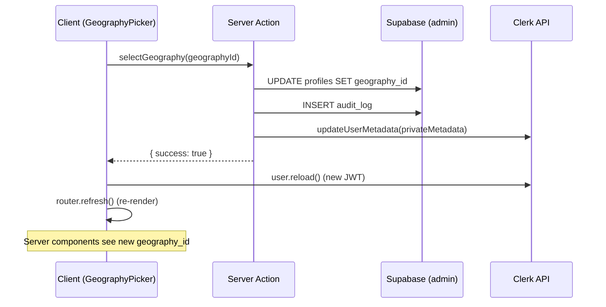

# feat: Self-service geography selection for champions

## Overview

Champions who sign up directly at `/hub` (bypassing the admin invite flow) land on a dead-end "Almost there!" screen because no geography is assigned. This plan replaces that screen with a geography picker — searchable list of available geographies plus a "create new" option — and fixes the underlying Clerk/Supabase data sync gaps.

## Problem Frame

The system has two champion onboarding paths: admin invitation (sets geography via Clerk `private_metadata`) and direct signup at `/hub` (no geography set). Direct signup leaves champions stuck because every dashboard page guards on `session.geographyId` being non-null. Additionally, `reassignGeography()` only updates Supabase, not Clerk — so admin reassignments create metadata drift.

(see origin: `docs/brainstorms/2026-05-01-self-service-geography-selection-requirements.md`)

## Requirements Trace

- R1. Show geography picker when authenticated champion has no geography
- R2. Picker displays all geographies with search/filter
- R3. Only show geographies without an active champion (one-per-geography enforced)
- R4. Champions can create a new geography
- R5. New geography requires name, region, country (US/CA); slug auto-generated
- R6. Assign geography in both Supabase and Clerk `private_metadata`, no re-login required
- R7. Fix `reassignGeography()` to also update Clerk `private_metadata`
- R8. Geography creation uses admin Supabase client

## Scope Boundaries

- Admin invite flow unchanged — works as-is
- No geography switching after initial selection (champion contacts admin)
- No admin approval for new geography creation
- `deactivateChampion()` has the same Clerk metadata gap as `reassignGeography()` but is out of scope — flag for follow-up

## Context & Research

### Relevant Code and Patterns

- `src/lib/auth.ts` — `requireAuth()` reads `geography_id` from Clerk `sessionClaims`
- `src/lib/actions/champions.ts` — `inviteChampion()` (Clerk API pattern), `reassignGeography()` (R7 target), `getChampionForGeography()` (notification routing)
- `src/app/api/webhooks/clerk/route.ts` — syncs Clerk events to Supabase `profiles`; has a bug where `|| null` fallback can overwrite geography on non-geography user updates
- `src/app/hub/(dashboard)/(champion)/dashboard/page.tsx` — null-geography guard to replace (lines 15-27), same guard in `prospects/page.tsx` and `prospects/[id]/page.tsx`
- `src/app/hub/(dashboard)/(champion)/prospects/new/page.tsx` — missing null-geography guard (discovered during research)
- `src/components/admin/champion-manager.tsx` — existing `availableGeographies` filtering pattern (lines 91-98)
- `src/lib/validations/intake-schema.ts` — Zod validation pattern to follow
- `src/lib/constants/geographies.ts` — `RESERVED_SLUGS`, `Geography` interface
- `src/lib/supabase/admin.ts` — `getSupabaseAdminClient()` for RLS bypass
- Hand-rolled form elements with Tailwind classes — no component library

### Institutional Learnings

- `docs/solutions/logic-errors/clerk-auth-redirect-loop-null-geography-2026-04-30.md` — documents why null-geography guards exist. The "Almost there!" blocks replaced a redirect loop. Any new geography page must not re-introduce this loop.
- `docs/solutions/best-practices/hub-auth-aware-layout-and-routing-patterns-2026-04-30.md` — auth pattern: call `auth()` once in server component, pass to client components. The `(dashboard)/layout.tsx` redirects to sign-in if `!userId` — geography picker lives inside this gate.
- `docs/solutions/performance-issues/double-auth-call-hub-page-routing-2026-04-30.md` ��� avoid calling `auth()` twice per request.

### External References

- Clerk Backend SDK: `clerkClient()` from `@clerk/nextjs/server` ships with `@clerk/nextjs@7.2.8` — provides `client.users.updateUserMetadata()` with deep-merge semantics
- Clerk session refresh: `user.reload()` from `useUser()` hook forces a new JWT client-side; followed by `router.refresh()` to re-render server components
- Clerk metadata update endpoint: `PATCH /v1/users/{user_id}/metadata` — deep merges, set key to `null` to remove

## Key Technical Decisions

- **Use `clerkClient()` SDK instead of raw fetch**: The codebase currently uses raw `fetch()` to `api.clerk.com` for invitations. The SDK is already bundled with `@clerk/nextjs` and provides typed methods. New code uses the SDK; existing `inviteChampion()` continues using raw fetch (not in scope to change).
- **Admin Supabase client for entire server action**: A champion with no geography has no `geography_id` JWT claim, which means RLS policies reject most writes. The geography selection/creation actions use `getSupabaseAdminClient()` for all Supabase operations (geography INSERT, profile UPDATE, audit_log INSERT).
- **GeographyPicker as client component**: The session refresh mechanism (`user.reload()` from Clerk's `useUser()` hook) requires client-side React. The picker is a `"use client"` component rendered inline where the "Almost there!" block currently lives.
- **Slug strategy: `slugify(name)-slugify(region)`**: Produces readable, location-specific slugs (e.g., `springfield-illinois`). Falls back to appending a numeric suffix on collision. Checked against `RESERVED_SLUGS`.
- **Profile lookup for audit logging**: The existing `audit_log.actor_id` is a UUID FK to `profiles.id`, but all existing server actions pass `session.userId` (a Clerk string like `user_xxx`). This is a pre-existing silent failure. The new actions look up `profiles.id` from `clerk_user_id` for correct audit logging. Fixing existing actions is out of scope.

## Open Questions

### Resolved During Planning

- **Session refresh mechanism**: Use `user.reload()` from Clerk `useUser()` hook after server action returns, then `router.refresh()` to re-render server components with new JWT claims. Confirmed from Clerk docs.
- **Clerk metadata field**: Continue using `private_metadata` (same as existing invite flow). The Clerk dashboard session token template is already configured to map these into session claims — changing to `public_metadata` would be a larger migration.
- **RLS for profile self-update**: Use admin client — no UPDATE policy exists for profiles, and the champion's JWT has no geography_id claim to satisfy RLS anyway.
- **Concurrent geography claims**: The DB unique index `idx_one_active_champion_per_geography` catches races. Server action catches the unique constraint error and returns a specific message; client refreshes the geography list.

### Deferred to Implementation

- **Exact Supabase error code for unique constraint violation**: Verify at implementation time whether Supabase returns a specific error code that can be pattern-matched vs a generic error.
- **Whether `router.refresh()` alone triggers a Clerk token refresh**: External research says it does not — `user.reload()` is required. Verify during implementation that the two-step `user.reload()` + `router.refresh()` works reliably.

## High-Level Technical Design

> *This illustrates the intended approach and is directional guidance for review, not implementation specification. The implementing agent should treat it as context, not code to reproduce.*

For geography creation, the flow prepends a `INSERT INTO geographies` step before the profile update.

## Implementation Units

- [x] **Unit 1: Database migration — audit_log actions**

  **Goal:** Add new audit action types so geography selection and creation can be logged.

  **Requirements:** R4, R5 (enables audit logging for new actions)

  **Dependencies:** None — must land first.

  **Files:**
  - Create: `supabase/migrations/006_geography_audit_actions.sql`
  - Modify: `src/types/database.ts` (add new action types to `AuditAction`)

  **Approach:**
  - `ALTER TABLE audit_log DROP CONSTRAINT IF EXISTS audit_log_action_check;`
  - `ALTER TABLE audit_log ADD CONSTRAINT audit_log_action_check CHECK (action IN (...existing values..., 'geography-select', 'geography-create'));`
  - Update the `AuditAction` TypeScript type to include the new values.

  **Patterns to follow:**
  - Existing migration files in `supabase/migrations/` (sequential numbering, descriptive comments)

  **Test scenarios:**
  - Happy path: migration applies cleanly, new action values accepted by the constraint
  - Edge case: existing audit_log rows with old action values are unaffected

  **Verification:** Migration runs without error. TypeScript type matches the DB constraint.

- [x] **Unit 2: Fix webhook handler — preserve geography on partial updates**

  **Goal:** Prevent the Clerk webhook from overwriting `geography_id` to null when a non-geography `user.updated` event fires.

  **Requirements:** R6 (data sync integrity)

  **Dependencies:** None — should land early to prevent race conditions.

  **Files:**
  - Modify: `src/app/api/webhooks/clerk/route.ts`
  - Test: `src/__tests__/webhooks/clerk-webhook.test.ts`

  **Approach:**
  - Change `const geographyId = data.private_metadata?.geography_id || null;` to only include `geography_id` in the upsert payload when it is explicitly present in `private_metadata`.
  - When `geography_id` is not present in the webhook payload, omit it from the upsert so the existing Supabase value is preserved.
  - When `geography_id` IS present (including explicitly `null`), include it in the upsert.

  **Patterns to follow:**
  - Existing webhook handler structure in `src/app/api/webhooks/clerk/route.ts`

  **Test scenarios:**
  - Happy path: `user.created` with `geography_id` in metadata → profile created with geography
  - Happy path: `user.updated` with `geography_id` in metadata → profile updated with new geography
  - Edge case: `user.updated` without `geography_id` in metadata → existing geography preserved
  - Edge case: `user.updated` with `geography_id: null` explicitly → geography cleared (intentional admin action)
  - Error path: invalid signature → 400 response, no profile change

  **Verification:** Existing webhook tests pass. New tests cover partial-metadata preservation.

- [x] **Unit 3: Validation schema and server actions**

  **Goal:** Create `selectGeography()` and `createGeography()` server actions with Zod validation.

  **Requirements:** R1, R3, R4, R5, R6, R8

  **Dependencies:** Unit 1 (audit actions), Unit 2 (webhook fix)

  **Files:**
  - Create: `src/lib/actions/geography-selection.ts`
  - Create: `src/lib/validations/geography-selection-schema.ts`
  - Test: `src/__tests__/actions/geography-selection.test.ts`

  **Approach:**

  *Validation schema:*
  - `selectGeographySchema`: validates `geographyId` as UUID string
  - `createGeographySchema`: validates `name` (1-100 chars, stripped HTML), `region` (1-100 chars), `country` (enum US/CA)

  *`selectGeography(geographyId)`:*
  - Call `requireAuthenticated()` — works for users with or without geography
  - Reject if `session.role !== 'champion'` — prevents admins or other roles from claiming geographies via this path
  - Check Supabase profile for existing `geography_id` (authoritative source, not the JWT claim):
    - If profile already has a geography AND Clerk `private_metadata` already has `geography_id` → reject as double-selection
    - If profile already has a geography BUT Clerk `private_metadata` is missing `geography_id` → skip the Supabase UPDATE and retry only the Clerk metadata call (recovery from prior partial failure)
    - If profile has no geography → proceed with full assignment
  - Look up the champion's `profiles.id` from `clerk_user_id` (for audit logging). If profile does not exist yet (webhook race), upsert a minimal profile row using the admin client before proceeding.
  - Use `getSupabaseAdminClient()` to UPDATE `profiles` SET `geography_id`
  - Catch unique constraint violation → return `{ success: false, error: "This geography was just claimed by another champion." }`
  - Call `clerkClient().users.updateUserMetadata(userId, { privateMetadata: { geography_id } })`
  - Insert audit_log entry with `action: 'geography-select'`
  - Return `{ success: true }`

  *`createGeography({ name, region, country })`:*
  - Call `requireAuthenticated()`
  - Reject if `session.role !== 'champion'`
  - Check Supabase profile for existing `geography_id` — reject if already assigned
  - Generate slug: `slugify(name)-slugify(region)`, check against `RESERVED_SLUGS` and existing slugs, append numeric suffix on collision
  - Use `getSupabaseAdminClient()` to INSERT into `geographies` with `status: 'pre-launch'`
  - Perform the geography assignment directly (UPDATE profiles, call `clerkClient().users.updateUserMetadata()`) rather than delegating to `selectGeography()` — avoids a duplicate `geography-select` audit entry
  - Insert a single audit_log entry with `action: 'geography-create'`
  - Return `{ success: true, geographyId }`

  *Error handling:*
  - If Clerk metadata update fails after Supabase update: return error with `{ success: false, error: "...", retryable: true }`. On retry, the action detects the Supabase assignment already exists (profile has `geography_id`) and skips straight to the Clerk metadata call. This prevents the "stuck state" where Supabase is updated but Clerk is not and the double-selection guard blocks retries.
  - If geography creation succeeds but assignment fails: same retry logic applies — the created geography exists and the profile update can be retried.

  **Patterns to follow:**
  - `src/lib/actions/champions.ts` — server action structure, `ActionResult` return type, `requireAdmin()` pattern
  - `src/lib/validations/intake-schema.ts` — Zod schema with `safeText()` helper, `stripHtml`
  - `src/lib/constants/geographies.ts` — `RESERVED_SLUGS`

  **Test scenarios:**
  - Happy path: `selectGeography` assigns geography, updates Supabase and Clerk metadata, writes audit log
  - Happy path: `createGeography` creates geography with correct slug, assigns it to champion
  - Auth: non-champion role (admin) → rejected with specific error
  - Edge case: user already has geography in both Supabase and Clerk → rejection (double-selection)
  - Edge case: Supabase has geography but Clerk does not (partial failure retry) → skips Supabase UPDATE, retries only Clerk metadata call
  - Edge case: concurrent claim (unique constraint violation) → specific error message
  - Edge case: slug collision → auto-suffixed slug (e.g., `springfield-illinois-2`)
  - Edge case: slug matches RESERVED_SLUGS → rejected or suffixed
  - Edge case: name/region with special characters → slug sanitized correctly
  - Edge case: profile row does not exist yet (webhook race) → upserted before assignment
  - Error path: Zod validation fails → specific error message
  - Error path: Clerk API call fails → error returned with `retryable: true`, Supabase changes noted
  - Integration: `selectGeography` → Clerk `updateUserMetadata` called with correct params
  - Integration: `createGeography` → geography inserted then assignment performed directly (not via `selectGeography`)

  **Verification:** All tests pass. Manual test: server action returns `{ success: true }` and Clerk metadata is updated (visible in Clerk dashboard).

- [x] **Unit 4: GeographyPicker client component**

  **Goal:** Build the searchable geography picker with "create new" flow, replacing the "Almost there!" UI.

  **Requirements:** R1, R2, R3, R4, R5, R6

  **Dependencies:** Unit 3 (server actions)

  **Files:**
  - Create: `src/components/dashboard/geography-picker.tsx`
  - Test: `src/__tests__/components/dashboard/geography-picker.test.tsx`

  **Approach:**

  *Component structure:*
  - `"use client"` component receiving `geographies` (available only — pre-filtered by server) and `userId` as props
  - Uses `useUser()` from `@clerk/nextjs` for session refresh, `useRouter()` for server component re-render
  - Two modes: **select existing** (default) and **create new** (toggled by button)

  *Select existing mode:*
  - Text input that filters the geography list in real time (match on name, region, country)
  - Filtered list below the input — each item shows name and region
  - Click to select → calls `selectGeography()` server action
  - When no results match search → show "create new" prompt with search term pre-filled as name

  *Create new mode:*
  - Inline form: name input, region input, country select (US/CA)
  - Submit → calls `createGeography()` server action
  - Cancel → back to select mode

  *After successful selection/creation:*
  - Call `await user.reload()` to refresh Clerk JWT
  - Call `router.refresh()` to re-render server components (which now read the new geography from session claims)

  *States:*
  - Default: search input + geography list
  - Loading: button shows "Assigning..." / "Creating..." with `disabled:opacity-50`
  - Error: inline error banner above the form (matching existing `bg-danger/10` pattern)
  - Stale claim error ("geography was just claimed"): error banner + auto-refresh list

  **Patterns to follow:**
  - `src/components/intake/intake-form.tsx` — client form with `useState` for loading/error, server action calls
  - `src/components/admin/champion-manager.tsx` — `availableGeographies` filtering pattern
  - Hand-rolled form elements with existing Tailwind classes (see Context & Research)

  **Test scenarios:**
  - Happy path: renders geography list, user types to filter, selects one → action called → success
  - Happy path: user clicks "create new", fills form, submits → action called → success
  - Edge case: empty search results → "create new" prompt shown with search term pre-filled
  - Edge case: all geographies claimed → list is empty, "create new" is the only option
  - Edge case: concurrent claim error → error banner shown, list refreshable
  - Error path: server action returns error → error banner displayed
  - Error path: Clerk `user.reload()` fails → graceful fallback (suggest page refresh)
  - Integration: after successful selection, `router.refresh()` is called

  **Verification:** Component renders correctly in all states. Selection flow completes end-to-end in browser.

- [x] **Unit 5: Page integration — replace null-geography guards**

  **Goal:** Wire GeographyPicker into all champion pages, replacing the "Almost there!" blocks. Add missing guard to prospects/new.

  **Requirements:** R1, R3

  **Dependencies:** Unit 4 (GeographyPicker component)

  **Files:**
  - Create: `src/lib/queries/geographies.ts` (shared `getAvailableGeographies()` helper)
  - Modify: `src/app/hub/(dashboard)/(champion)/dashboard/page.tsx`
  - Modify: `src/app/hub/(dashboard)/(champion)/prospects/page.tsx`
  - Modify: `src/app/hub/(dashboard)/(champion)/prospects/[id]/page.tsx`
  - Modify: `src/app/hub/(dashboard)/(champion)/prospects/new/page.tsx` (convert to server component)
  - Create: `src/components/dashboard/new-prospect-form.tsx` (extracted client form from prospects/new)
  - Test: `src/__tests__/null-geography-guards.test.tsx` (update existing tests)

  **Approach:**
  - Extract the "fetch available geographies" query into `src/lib/queries/geographies.ts` as `getAvailableGeographies()` — fetches all geographies, joins against active champion profiles, excludes those with an active champion. This is the single source of filtered geographies for both Unit 4 and Unit 5.
  - **Server component pages** (`dashboard/page.tsx`, `prospects/page.tsx`, `prospects/[id]/page.tsx`): In each page's `if (!session.geographyId)` block, replace the static "Almost there!" JSX with `<GeographyPicker geographies={availableGeographies} userId={session.userId} />`, where `availableGeographies` comes from `getAvailableGeographies()`.
  - **Client component page** (`prospects/new/page.tsx`): This page is `"use client"` and cannot call `requireAuthenticated()` or server-side queries directly. Convert it to a server component that calls `requireAuthenticated()` and delegates to a `<NewProspectForm />` client component child. The server component handles the geography guard and passes `availableGeographies` to GeographyPicker when `!session.geographyId`, or renders `<NewProspectForm />` when geography is present. Note: the `createProspect` server action already has a server-side geography guard (returns "No geography assigned"), so this change adds UI-level protection rather than fixing a security gap.

  **Patterns to follow:**
  - Existing null-geography guard pattern in `dashboard/page.tsx` (lines 15-27)
  - `src/components/admin/champion-manager.tsx` lines 91-98 for available geography filtering logic
  - The server-component-wraps-client-component pattern used by `dashboard/page.tsx` itself (server component fetches data, passes to client children)

  **Test scenarios:**
  - Happy path: champion with no geography sees GeographyPicker on dashboard
  - Happy path: champion with geography sees normal dashboard (no picker)
  - Happy path: prospects/new page shows picker when no geography (new guard)
  - Edge case: champion assigned geography between page load and interaction → picker still works (server action handles)

  **Verification:** All existing null-geography tests updated. Navigate to `/hub/dashboard`, `/hub/prospects`, `/hub/prospects/new` as a no-geography champion — picker appears on all. Navigate as a geography-assigned champion — normal content on all.

- [x] **Unit 6: Fix reassignGeography Clerk metadata sync**

  **Goal:** Close the Clerk/Supabase sync gap in admin geography reassignment.

  **Requirements:** R7

  **Dependencies:** Unit 3 (uses same `clerkClient()` pattern)

  **Files:**
  - Modify: `src/lib/actions/champions.ts`
  - Test: `src/__tests__/actions/champion-actions.test.ts` (or create if absent)

  **Approach:**
  - After nulling the old champion's `geography_id` in Supabase, also call `clerkClient().users.updateUserMetadata(oldChampionClerkUserId, { privateMetadata: { geography_id: null } })` to clear their Clerk metadata.
  - After setting the new champion's `geography_id` in Supabase, also call `clerkClient().users.updateUserMetadata(newChampionClerkUserId, { privateMetadata: { geography_id: newGeographyId } })`.
  - Need to look up each champion's `clerk_user_id` from their profile to call the Clerk API.
  - Error handling: if a Clerk API call fails after Supabase updates, return error. Document that Supabase changes are not rolled back (consistent with existing behavior).

  **Patterns to follow:**
  - Unit 3's `clerkClient()` usage pattern
  - Existing `reassignGeography()` structure in `src/lib/actions/champions.ts`

  **Test scenarios:**
  - Happy path: reassignment updates both Supabase and Clerk for old and new champion
  - Edge case: no current champion on geography → only new champion updated
  - Error path: Clerk update for old champion fails → error returned
  - Error path: Clerk update for new champion fails after old champion cleared → error returned (partial state documented)
  - Integration: verify `clerkClient().users.updateUserMetadata` called with correct user IDs and metadata

  **Verification:** Tests pass. Manual test via admin UI: reassign a champion, verify both champions' Clerk metadata updated (check Clerk dashboard).

## System-Wide Impact

- **Interaction graph:** The geography selection server action writes to Supabase (profiles, geographies, audit_log) AND calls the Clerk API (updateUserMetadata). The webhook handler fires on Clerk user updates — Unit 2 ensures it doesn't overwrite the geography. The session refresh (`user.reload()`) triggers Clerk to mint a new JWT with the updated claims.
- **Error propagation:** Server action errors return `{ success: false, error: "..." }` to the client component, which displays inline. Clerk API failures after Supabase writes create temporary inconsistency (documented, not transactional).
- **State lifecycle risks:** Between server action completion and `user.reload()`, there is a brief window where Supabase has the geography but the JWT does not. The client-side `user.reload()` + `router.refresh()` sequence closes this window. If `user.reload()` fails, the champion can refresh the page manually.
- **API surface parity:** The admin invite flow (`inviteChampion()`) already handles geography assignment at invite time. The self-service flow adds a post-signup assignment path. Both use Clerk `private_metadata` for the same field.
- **Unchanged invariants:** One champion per geography (DB unique index), RLS scoping by `geography_id` JWT claim, admin-only access to champion management pages, Clerk middleware auth context pattern.

## Risks & Dependencies

| Risk | Mitigation |
|------|------------|
| Clerk `user.reload()` does not refresh JWT claims in time for `router.refresh()` | Test empirically. Fallback: brief loading state that polls until `sessionClaims.geography_id` is non-null, or full page reload. |
| Webhook fires between server action and `user.reload()`, overwriting geography | Unit 2 fixes this by preserving geography when absent from webhook payload. |
| Two champions race to select the same geography | DB unique index catches this. Server action returns specific error. Client refreshes list. |
| Clerk API rate limits during high signup volume | Unlikely at current scale (54 geographies). If needed, add retry with backoff. |
| `private_metadata` session claim mapping stops working | Pre-existing risk — same mechanism as invite flow. Monitor with existing auth tests. |

## Sources & References

- **Origin document:** [docs/brainstorms/2026-05-01-self-service-geography-selection-requirements.md](../brainstorms/2026-05-01-self-service-geography-selection-requirements.md)
- **Related solution:** [docs/solutions/logic-errors/clerk-auth-redirect-loop-null-geography-2026-04-30.md](../solutions/logic-errors/clerk-auth-redirect-loop-null-geography-2026-04-30.md)
- Clerk updateUserMetadata: https://clerk.com/docs/reference/backend/user/update-user-metadata
- Clerk session token refresh: https://clerk.com/docs/guides/sessions/force-token-refresh
- Clerk session customization: https://clerk.com/docs/guides/sessions/customize-session-tokens
