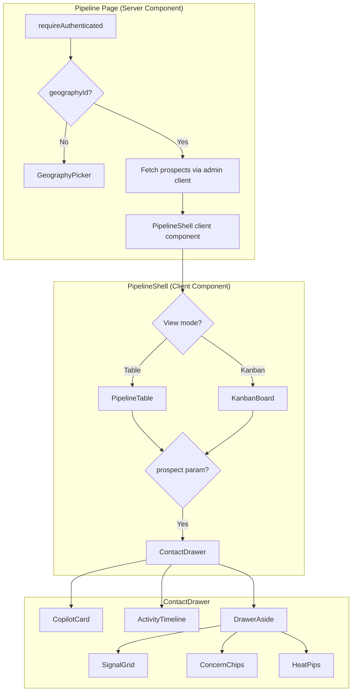
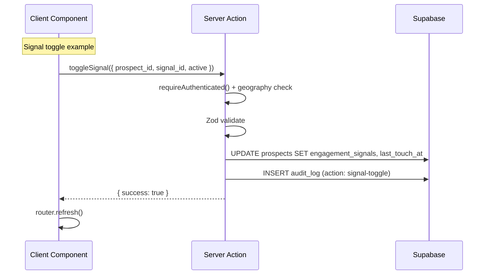

# feat: Pipeline CRM for champions

## Overview

Replace the existing `/hub/prospects` section with a full Pipeline CRM at `/hub/pipeline` inside the `(dashboard)/(champion)` route group. Champions get a table view with heat/stage/concerns/last-touch at a glance, a kanban view for visual stage management, a slide-out contact drawer with a deterministic co-pilot that recommends next actions, and engagement signal tracking — all geography-scoped via existing Clerk + Supabase RLS.

## Problem Frame

Champions have a basic prospect list with name, email, status, and follow-up date. This is too thin to function as a CRM — they can't see which families are hot, which are going cold, what concerns are blocking progress, or what to do next. The pipeline feature gives champions the situational awareness they need to move families through stages and a co-pilot that synthesizes prospect data into actionable recommendations.

(see origin: `docs/brainstorms/pipeline-crm-requirements.md`)

## Requirements Trace

**Schema (R1-R7):** Add `heat_score`, `concerns`, `engagement_signals`, `last_touch_at`, `neighborhood` to prospects. Create `library_items` and `library_sends` tables (schema only, no UI). Make `parent_email` nullable.

**Pipeline Table (R8-R12):** Pipeline page inside `(dashboard)/(champion)` with stage/neighborhood filter pills, enriched table columns, and Add Prospect modal.

**Kanban (R13-R14):** Toggle between table/kanban. 4 active columns, drag-and-drop with transition validation.

**Contact Drawer (R15-R18):** URL-driven 920px slide-out with co-pilot block, activity timeline, and aside (signals, concerns, heat, notes).

**Co-pilot (R19-R23):** Deterministic rules engine — briefing, suggested next move, suggested library items.

**Engagement Signals (R24-R25):** Toggleable signal grid with immediate persistence.

**Visual Design (R26-R27):** Existing Tailwind 4 tokens, Archivo/Inter/Instrument Serif typography.

**Access Control (R28-R29):** Clerk champion session + geography match on all server actions. Input length bounds.

**Empty States (R30-R34):** Pipeline table, filtered table, kanban columns, co-pilot insufficient data, empty timeline.

## Scope Boundaries

- No LLM-powered co-pilot — v1 is fully rules-based and deterministic
- No library UI — `library_items` and `library_sends` tables are created and seeded for the co-pilot to query; the full `/hub/library` page ships separately
- No dashboard reshape — KPI strip, thermometer, and Today's Briefing are separate
- No prospect notifications — prospects added manually are private notes, never notified
- No cross-geography visibility — champions see only their own geography's prospects
- No leaderboard — explicitly cut from design

## Context & Research

### Relevant Code and Patterns

- `src/app/hub/(dashboard)/(champion)/prospects/page.tsx` — existing prospects page pattern: `requireAuthenticated()` → geography guard → `getSupabaseAdminClient()` query → render table. Pipeline page follows this exact pattern.
- `src/app/hub/(dashboard)/(champion)/prospects/[id]/page.tsx` — existing prospect detail with children + notes. Drawer replaces this.
- `src/components/dashboard/prospect-table.tsx` — `@tanstack/react-table` with `createColumnHelper<ProspectRow>()`, `getCoreRowModel`, `getSortedRowModel`, `getFilteredRowModel`. Pipeline table extends this pattern with new columns.
- `src/components/dashboard/prospect-detail.tsx` — client component with `ALLOWED_TRANSITIONS[status]` dropdown, server action calls, `router.refresh()`. Drawer reuses this interaction pattern.
- `src/lib/actions/prospects.ts` — server action pattern: `"use server"` → `requireAuthenticated()` → null-geography guard → Zod `safeParse` → `getSupabaseServerClient()` mutation → audit_log insert → return `ActionResult`. All new actions follow this.
- `src/lib/constants/pipeline.ts` — `PIPELINE_STAGES`, `ALLOWED_TRANSITIONS`, `STAGE_COLORS`, `STAGE_LABELS`, `isValidTransition()`.
- `src/lib/validations/prospect-schema.ts` — Zod schemas with `stripHtml` transform.
- `src/types/database.ts` — `DbProspect`, `AuditAction` type union.
- `src/app/hub/(dashboard)/layout.tsx` — dashboard layout with header nav; line 54 has champion nav link `href='/hub/prospects'` that must update to `/hub/pipeline`.
- `src/components/hub/hub-sidebar.tsx` — `WORKSPACE_ITEMS` already has Pipeline at `/hub/pipeline`.
- `supabase/migrations/006_geography_audit_actions.sql` — pattern for extending audit_log CHECK constraint.
- `next.config.ts` — existing redirects for `/prospects` → `/hub/prospects`.

### Institutional Learnings

- **Clerk + Supabase auth cascade** (`docs/solutions/integration-issues/clerk-supabase-vercel-auth-cascade-failure-2026-05-01.md`): Use `getSupabaseAdminClient()` for reads in Clerk-authed server components. Use `getSupabaseServerClient()` for writes in server actions. Never use the anon client.
- **Null-geography guard** (`docs/solutions/logic-errors/clerk-auth-redirect-loop-null-geography-2026-04-30.md`): Every champion page and server action must handle null geography with a styled pending state or error return — never redirect.
- **Route group structure** (`docs/solutions/best-practices/hub-auth-aware-layout-and-routing-patterns-2026-04-30.md`): `(dashboard)/layout.tsx` provides auth guard + header. `(champion)/` nests inside for role-specific pages.
- **Pipeline placeholder origin** (`docs/solutions/ui-bugs/missing-hub-placeholder-pages-cause-404-2026-05-01.md`): Current pipeline page at `src/app/hub/pipeline/page.tsx` is intentionally outside `(dashboard)/`. Must move inside for auth gating.
- **Double auth call** (`docs/solutions/performance-issues/double-auth-call-hub-page-routing-2026-04-30.md`): Call `requireAuthenticated()` once per server component. Pass session data as props.

### Net-New Patterns (No Existing Precedent)

These features have no existing codebase pattern. Implementation will establish the pattern:
- URL-driven slide-out drawer with search param state
- Drag-and-drop kanban (no DnD library installed)
- Toast notifications (no toast system exists)
- Client-side view preference persistence (no localStorage usage exists)
- Deterministic rules engine
- Form modals (no modal primitive exists)

## Key Technical Decisions

- **`parent_email` becomes nullable**: R12 makes email optional in the Add Prospect modal. Migration alters the column to `DROP NOT NULL`. The existing unique constraint `UNIQUE (geography_id, parent_email)` is replaced with a partial unique index `WHERE parent_email IS NOT NULL` — PostgreSQL treats NULLs as distinct, so email-less prospects don't conflict. Deduplication for email-less prospects relies on champion judgment (they see names in the table).

- **Children optional in new Add Prospect flow**: The existing `createProspectSchema` requires `.min(1)` children. The new pipeline modal (R12) is designed for quick name-only entry. A new `createPipelineProspectSchema` is created without the children requirement. Children can be added later from the contact drawer. The existing `createProspect` action is left unchanged for any code path that still uses it.

- **Activity timeline sources audit_log**: Signal toggles, concern updates, and heat overrides need to appear in the activity timeline (R17) but have no storage mechanism in existing tables. Rather than creating a new table, these events are recorded in `audit_log` with new action types (`signal-toggle`, `concern-update`, `heat-override`). The timeline query merges `notes` (blue dot), `status_history` (purple dot), and filtered `audit_log` entries (green/amber/coral dots) into a chronological feed. The audit_log already has `prospect_id`, `actor_id`, `metadata`, and `created_at` — the metadata field stores display-friendly details (e.g., which signal was toggled).

- **`last_touch_at` backfilled from `updated_at`**: Existing prospects get `last_touch_at = COALESCE(updated_at, created_at)` in the migration. This prevents the co-pilot's `daysSince` calculation from returning infinity and triggering rule #2 ("21 days cold") for every existing prospect on launch day.

- **Heat auto-suggestion is a pure function**: `suggestHeat(signals, daysSinceLast, stage)` computes a suggested heat from stage base score + signal bonus - recency penalty, clamped to 1-5. Champions can override manually. The stored `heat_score` is the final value (whether auto-suggested or manually set).

- **Neighborhood autocomplete with case-insensitive filtering**: Neighborhood is free-text (R5) but the Add Prospect modal offers autocomplete from existing values in the champion's geography. Filter pills use case-insensitive `LOWER()` grouping to prevent "Port Credit" and "port credit" from appearing as separate filters.

- **Drawer overlays without backdrop**: The 920px drawer slides over the table content without a backdrop. Clicking another prospect row while the drawer is open swaps the URL param and loads the new prospect — enabling rapid switching through 20+ prospects per session. Clicking outside the drawer area (on the table) or pressing Escape closes it.

- **Kanban defaults to table on mobile**: Drag-and-drop on touch devices without a DnD library is unreliable. Below 768px, the view toggle is hidden and the pipeline defaults to table view. The drawer becomes a full-screen sheet on mobile.

- **Kanban uses optimistic updates**: Valid drops optimistically move the card to the new column and fire the server action. On failure (network error, concurrency conflict, invalid transition), the card snaps back to its source column with an error toast.

- **"Send from library" button is hardcoded hidden**: A constant `LIBRARY_UI_ENABLED = false` in `src/lib/constants/pipeline.ts` controls the button visibility in the drawer header (R16). Flip to `true` when the library UI ships.

- **Private notes are existing notes**: "Private notes" in the drawer aside (R18) are the same `notes` table entries. "Private" refers to the geography-scoped RLS that already restricts visibility. No new table or flag needed.

- **View preference persisted in localStorage**: Kanban/table toggle preference (R13) is stored in `localStorage` under `pipeline-view-preference`. No server roundtrip needed — this is a personal UI preference that doesn't need to survive device switches.

## Open Questions

### Resolved During Planning

- **Routing consolidation mechanics (R8)**: Pipeline page moves to `src/app/hub/(dashboard)/(champion)/pipeline/page.tsx`. Dashboard header nav link updates from `/hub/prospects` to `/hub/pipeline`. Sidebar already points to `/hub/pipeline`. Redirects in `next.config.ts` updated. For `/hub/prospects/[id]` → `/hub/pipeline?prospect={id}`, Next.js `redirects()` can't map path params to query params, so a minimal redirect server component remains at the old path.
- **View preference persistence (R13)**: `localStorage` with key `pipeline-view-preference`. Simplest option; device sync not needed for a UI preference.
- **Heat auto-suggestion algorithm (R1)**: Pure function `suggestHeat(signals, daysSinceLast, stage)`. Base from stage (interested=3, shadow-day=3, committed=4, enrolled=5, lost=1), +1 if ≥3 signals, +2 if ≥5 signals, -1 if daysSince >14, -2 if daysSince >21. Clamp 1-5. "interested" base is 3 (not 2) to match the default heat_score and prevent degenerate clustering at heat 1-2. Tunable later.
- **Activity timeline event types (R17)**: Timeline merges three sources — notes (blue), status_history (purple), and audit_log entries for signal-toggle (green), concern-update (amber), heat-override (coral). Each source queried independently and merged client-side by `created_at` descending.
- **Library items seed data (R6)**: ~16 starter items covering each concern, mix of types (faq, talking, data, quote). Content is directional guidance for the implementer — exact copy can be refined post-launch.
- **Email optionality conflict**: `parent_email` made nullable in migration. Partial unique index preserves deduplication for prospects that have email.
- **Children optionality conflict**: New `createPipelineProspectSchema` without children requirement. Children addable from drawer.
- **Audit log action constraint**: Extended with `signal-toggle`, `concern-update`, `heat-override`. Same migration pattern as 006.
- **`last_touch_at` initialization**: Backfilled with `COALESCE(updated_at, created_at)`.
- **Drawer-table interaction**: Overlay without backdrop. Click another row to swap prospects.
- **Mobile kanban**: Default to table view below 768px.

### Deferred to Implementation

- **Exact toast component implementation**: No toast primitive exists. Build a minimal toast (position: bottom-right, auto-dismiss after 4s, supports success/error variants). Verify it doesn't conflict with the drawer z-index.
- **DnD implementation approach**: No DnD library installed. Evaluate whether native HTML Drag and Drop API is sufficient for the 4-column kanban, or whether `@dnd-kit/core` is needed. Native API may have browser inconsistencies. Decide at implementation time based on testing.
- **Optimistic concurrency for new mutation types**: Existing `updateProspectStatus` checks `updated_at` for concurrency. New actions (signal toggle, concern update, heat override) also modify the prospects row. Determine at implementation time whether each action needs the same `updated_at` check or whether the last-write-wins approach is acceptable for non-critical fields.

## High-Level Technical Design

> *Directional guidance for review, not implementation specification.*





### suggestHeat Algorithm (Directional)

```
function suggestHeat(signals: string[], daysSinceLast: number, stage: PipelineStage): number {
  const BASE: Record<PipelineStage, number> = {
    interested: 3, "shadow-day": 3, committed: 4, enrolled: 5, lost: 1
  }
  let heat = BASE[stage]
  if (signals.length >= 5) heat += 2
  else if (signals.length >= 3) heat += 1
  if (daysSinceLast > 21) heat -= 2
  else if (daysSinceLast > 14) heat -= 1
  return Math.max(1, Math.min(5, heat))
}
```

### deriveNextMove Rules (from R22)

First-match-wins against prospect data. The function is pure — no side effects, no database queries. The `sentConcerns` set (concerns for which a library item has been sent) is derived from `library_sends` and passed as a parameter. Rule 3 is generalized from R22: instead of checking only tuition, it finds the first concern in the prospect's concerns array that has no corresponding library_sends entry and recommends sending an item for that concern. This makes the co-pilot useful for all 8 concern types.

## Implementation Units

- [ ] **Unit 1: Schema migration — pipeline enhancements**

  **Goal:** Add new columns to prospects, create library tables, extend audit_log, seed library items.

  **Requirements:** R1, R2, R3, R4, R5, R6, R7, R12 (email nullable), R28 (audit actions)

  **Dependencies:** None — must land first.

  **Files:**
  - Create: `supabase/migrations/007_pipeline_enhancements.sql`
  - Modify: `src/types/database.ts` (extend `DbProspect`, add `DbLibraryItem`, `DbLibrarySend`, extend `AuditAction`)
  - Modify: `src/components/dashboard/prospect-table.tsx` (update `ProspectRow.parent_email` type to `string | null`, add null guard on `.toLowerCase()` call)
  - Modify: `src/components/dashboard/prospect-detail.tsx` (update `ProspectDetailData.parent_email` type to `string | null`, guard unconditional render)

  **Approach:**

  *Prospects table alterations:*
  - `ALTER TABLE prospects ADD COLUMN heat_score smallint NOT NULL DEFAULT 3 CHECK (heat_score BETWEEN 1 AND 5);`
  - `ALTER TABLE prospects ADD COLUMN concerns text[] NOT NULL DEFAULT '{}';`
  - `ALTER TABLE prospects ADD COLUMN engagement_signals text[] NOT NULL DEFAULT '{}';`
  - `ALTER TABLE prospects ADD COLUMN last_touch_at timestamptz;`
  - `UPDATE prospects SET last_touch_at = COALESCE(updated_at, created_at);`
  - `ALTER TABLE prospects ALTER COLUMN last_touch_at SET NOT NULL;` (after backfill)
  - `ALTER TABLE prospects ALTER COLUMN last_touch_at SET DEFAULT now();`
  - `ALTER TABLE prospects ADD COLUMN neighborhood text;`
  - `ALTER TABLE prospects ALTER COLUMN parent_email DROP NOT NULL;`
  - Drop existing unique constraint on `(geography_id, parent_email)`, replace with partial unique index: `CREATE UNIQUE INDEX idx_prospects_geo_email ON prospects (geography_id, parent_email) WHERE parent_email IS NOT NULL;`

  *Library items table:*
  - `id uuid PRIMARY KEY DEFAULT gen_random_uuid()`
  - `type text NOT NULL CHECK (type IN ('faq', 'quote', 'talking', 'data'))`
  - `title text NOT NULL`
  - `body text NOT NULL`
  - `concern text` (nullable — matches concerns enum values, null = general)
  - `helpfulness_score smallint NOT NULL DEFAULT 0`
  - `send_count int NOT NULL DEFAULT 0`
  - `geography_id uuid REFERENCES geographies(id)` (nullable — null = global)
  - `created_at timestamptz NOT NULL DEFAULT now()`
  - `updated_at timestamptz NOT NULL DEFAULT now()`
  - RLS: enable, add policy for champion read access scoped to geography or global items

  *Library sends table:*
  - `id uuid PRIMARY KEY DEFAULT gen_random_uuid()`
  - `library_item_id uuid NOT NULL REFERENCES library_items(id)`
  - `prospect_id uuid NOT NULL REFERENCES prospects(id) ON DELETE CASCADE`
  - `champion_id uuid NOT NULL REFERENCES profiles(id)`
  - `geography_id uuid NOT NULL REFERENCES geographies(id)`
  - `channel text NOT NULL`
  - `sent_at timestamptz NOT NULL DEFAULT now()`
  - RLS: enable, add policy for champion read access scoped to `geography_id`

  *Audit log:*
  - Drop and re-create CHECK constraint adding: `'signal-toggle', 'concern-update', 'heat-override'`

  *Seed library items:*
  - ~16 starter items covering each concern. Mix of types:
    - tuition: "Three things to say to the tuition-skeptic spouse" (talking), "Alpha School cost vs private school comparison" (data)
    - pace: "How self-paced learning works at Alpha" (faq), "Parent testimonial on pace flexibility" (quote)
    - accreditation: "Alpha School accreditation status FAQ" (faq), "Accreditation comparison data" (data)
    - screen-time: "Screen time breakdown at Alpha" (data), "How we balance screen and hands-on learning" (faq)
    - socialization: "Socialization at Alpha School" (faq), "Parent testimonial on social life" (quote)
    - transcripts: "How transcripts and college readiness work" (faq)
    - religion: "Alpha School's approach to values and faith" (faq)
    - spouse-buy-in: "Getting your spouse on board with Alpha" (talking), "Spouse buy-in conversation starters" (talking)
  - All seed items have `geography_id = NULL` (global) and `helpfulness_score = 0`

  **Patterns to follow:**
  - `supabase/migrations/006_geography_audit_actions.sql` for CHECK constraint update pattern
  - `supabase/migrations/001_initial_schema.sql` for table creation and RLS policy patterns

  **Test scenarios:**
  - Migration applies cleanly on a database with existing prospects data
  - Existing prospect rows retain all current data, gain new columns with defaults
  - `last_touch_at` backfilled correctly (not null for any existing row)
  - `parent_email` nullable — insert a prospect without email succeeds
  - Partial unique index — two prospects with same email in same geography still rejected; two prospects with null email in same geography allowed
  - Library items seeded — query returns items for each concern
  - New audit actions accepted by the CHECK constraint
  - Existing audit_log rows unaffected
  - `library_sends` ON DELETE CASCADE — deleting a prospect cascades to library_sends rows
  - Existing `prospect-table.tsx` and `prospect-detail.tsx` render without error after migration (null-email safety)

  **Verification:** Migration runs without error. `DbProspect`, `DbLibraryItem`, `DbLibrarySend` types match the schema. `AuditAction` type includes new values.

- [ ] **Unit 2: Pipeline constants, types & validation schemas**

  **Goal:** Define the constrained enum sets, type updates, validation schemas, and pure helper functions that all subsequent units depend on.

  **Requirements:** R2, R3, R22, R25, R29

  **Dependencies:** Unit 1 (types must match migration schema)

  **Files:**
  - Modify: `src/lib/constants/pipeline.ts` (add concerns enum, signals enum with labels, `LIBRARY_UI_ENABLED` flag)
  - Create: `src/lib/validations/pipeline-schemas.ts` (new Zod schemas)
  - Create: `src/lib/pipeline/copilot-engine.ts` (`deriveNextMove`, `suggestHeat`)
  - Test: `src/__tests__/constants/pipeline.test.ts` (extend existing)
  - Test: `src/__tests__/validations/pipeline-schemas.test.ts`
  - Test: `src/__tests__/lib/copilot-engine.test.ts`

  **Approach:**

  *Constants (in `pipeline.ts`):*
  ```
  CONCERNS = ["tuition", "pace", "accreditation", "screen-time", "socialization", "transcripts", "religion", "spouse-buy-in"]
  CONCERN_LABELS: Record<Concern, string>
  ENGAGEMENT_SIGNALS = ["faq", "1-1", "intro", "deposit", "tour", "shadow"]
  SIGNAL_LABELS: Record<Signal, string> (e.g., "faq" → "Sent FAQ")
  LIBRARY_UI_ENABLED = false
  ```

  *Validation schemas (in `pipeline-schemas.ts`):*
  - `createPipelineProspectSchema`: parent_first (required, max 100), parent_last (required, max 100), parent_email (optional, email format), parent_phone (optional, max 20), spouse_name (optional, max 200), neighborhood (optional, max 100), source (optional, max 100). All text fields get `stripHtml` transform.
  - `toggleSignalSchema`: prospect_id (uuid), signal_id (enum of ENGAGEMENT_SIGNALS), active (boolean)
  - `updateConcernsSchema`: prospect_id (uuid), concerns (array of enum CONCERNS, max 8)
  - `overrideHeatSchema`: prospect_id (uuid), heat_score (int 1-5)
  - `addPipelineNoteSchema`: prospect_id (uuid), body (string, 1-2000 chars, stripHtml)

  *Co-pilot engine (in `copilot-engine.ts`):*
  - `suggestHeat(signals, daysSinceLast, stage)` — pure function per algorithm in Technical Design
  - `deriveNextMove(prospect, sentConcerns: Set<string>)` — pure function implementing R22 rules (rule 3 generalized to check any unaddressed concern), first match wins. Returns `{ message: string; ruleId: number }`.

  **Patterns to follow:**
  - Existing `PIPELINE_STAGES` and `STAGE_LABELS` pattern in `pipeline.ts`
  - Existing Zod schemas in `prospect-schema.ts`

  **Test scenarios:**

  *suggestHeat:*
  - Stage-only: interested with 0 signals, 0 days → heat 3
  - Signal bonus: interested with 3 signals → heat 4
  - Signal bonus cap: interested with 5 signals → heat 5
  - Recency penalty: interested with 0 signals, 15 days → heat 2
  - Severe recency: interested with 0 signals, 22 days → heat 1
  - Enrolled stage: enrolled with 0 signals, 0 days → heat 5
  - Lost stage: lost always → heat 1
  - Mixed: shadow-day with 4 signals, 16 days → 3 + 1 - 1 = 3
  - Differentiation: interested with 3 signals, 15 days → 3 + 1 - 1 = 3 (signals counteract recency)

  *deriveNextMove:*
  - Rule 1: lost stage → "no action needed"
  - Rule 2: daysSince 22, heat 2 → "last public-event invite"
  - Rule 2 not triggered: daysSince 22, heat 3 → falls through
  - Rule 3: concerned about tuition, hasn't sent tuition item → tuition recommendation
  - Rule 3: concerned about screen-time, hasn't sent screen-time item → screen-time recommendation
  - Rule 3: concerned about tuition (sent) + accreditation (not sent) → accreditation recommendation (first unaddressed)
  - Rule 3 skipped: all concerns have sent items → falls through
  - Rule 4: interested, heat 4, daysSince 6 → "coffee or shadow day"
  - Rule 5: shadow-day stage → "confirm logistics"
  - Rule 6: committed stage → "loop into depositors"
  - Rule 7: fallback → "check in with personalized note"

  *Validation schemas:*
  - createPipelineProspectSchema: valid minimal (first+last only), valid full, rejects empty first name, rejects email that's not email format, strips HTML
  - toggleSignalSchema: valid toggle, rejects unknown signal ID
  - updateConcernsSchema: valid concerns array, rejects unknown concern values
  - overrideHeatSchema: valid 1-5, rejects 0, rejects 6

  **Verification:** All tests pass. Types compile without error.

- [ ] **Unit 3: Pipeline server actions**

  **Goal:** Create all server-side mutation endpoints for the pipeline feature.

  **Requirements:** R4, R12, R24, R28, R29

  **Dependencies:** Unit 1 (schema), Unit 2 (validation schemas)

  **Files:**
  - Create: `src/lib/actions/pipeline.ts`
  - Test: `src/__tests__/actions/pipeline-actions.test.ts`

  **Approach:**

  All actions follow the existing pattern from `src/lib/actions/prospects.ts`:
  1. `"use server"` directive
  2. `requireAuthenticated()` → check `session.geographyId` → Zod `safeParse` → `getSupabaseServerClient()` mutation → audit_log insert → return `ActionResult`
  3. Every mutation that modifies a prospect also updates `last_touch_at = new Date().toISOString()` (R4)

  *Actions to implement:*

  `createPipelineProspect(data)`:
  - Uses `createPipelineProspectSchema` (no children required)
  - Inserts with `status: "interested"`, `heat_score: 3`, `consent_given: true`, `consent_at: now()`
  - Returns `{ success: true, prospectId }`

  `toggleSignal(data)`:
  - Fetches current `engagement_signals` array
  - Validates geography match
  - Adds or removes the signal ID from the array
  - Updates `engagement_signals` and `last_touch_at`
  - Inserts audit_log with `action: "signal-toggle"`, metadata: `{ signal_id, active }`

  `updateConcerns(data)`:
  - Validates geography match
  - Replaces entire concerns array
  - Updates `concerns` and `last_touch_at`
  - Inserts audit_log with `action: "concern-update"`, metadata: `{ concerns }`

  `overrideHeat(data)`:
  - Validates geography match
  - Updates `heat_score` and `last_touch_at`
  - Inserts audit_log with `action: "heat-override"`, metadata: `{ old_heat, new_heat }`

  `addPipelineNote(data)`:
  - Same as existing `addNote` but also updates `last_touch_at` on the prospect
  - Can reuse or wrap existing `addNote` logic

  **Patterns to follow:**
  - `src/lib/actions/prospects.ts` — action structure, `ActionResult` return type, geography guard, audit_log insert
  - `src/lib/actions/geography-selection.ts` — profile lookup pattern for audit_log actor_id

  **Test scenarios:**
  - Auth: each action rejects unauthenticated calls
  - Auth: each action rejects calls with no geography
  - Auth: each action rejects prospect from different geography
  - createPipelineProspect: creates with defaults, returns prospectId
  - createPipelineProspect: optional email works (null stored)
  - toggleSignal: adds signal to empty array
  - toggleSignal: removes existing signal
  - toggleSignal: rejects unknown signal ID
  - toggleSignal: updates last_touch_at
  - updateConcerns: replaces concerns array
  - updateConcerns: rejects unknown concern values
  - overrideHeat: updates heat, records old value in audit metadata
  - overrideHeat: rejects value outside 1-5
  - addPipelineNote: creates note and updates last_touch_at

  **Verification:** All tests pass. Manual test: call each action from a test page and verify database changes.

- [ ] **Unit 4: Pipeline page and table view**

  **Goal:** Build the main pipeline page with enriched table, filter pills, Add Prospect modal, and empty states.

  **Requirements:** R8, R9, R10, R11, R12, R26, R27, R30, R31

  **Dependencies:** Unit 1 (schema), Unit 2 (constants/types), Unit 3 (server actions)

  **Files:**
  - Create: `src/app/hub/(dashboard)/(champion)/pipeline/page.tsx` (server component)
  - Create: `src/components/dashboard/pipeline-shell.tsx` (client component — view toggle, filters, table/kanban container)
  - Create: `src/components/dashboard/pipeline-table.tsx` (client component — extended table)
  - Create: `src/components/dashboard/pipeline-filters.tsx` (client component — stage + neighborhood filter pills)
  - Create: `src/components/dashboard/add-prospect-modal.tsx` (client component — modal overlay)
  - Create: `src/components/dashboard/pipeline-empty-state.tsx` (empty state components)
  - Test: `src/__tests__/components/dashboard/pipeline-table.test.tsx`
  - Test: `src/__tests__/components/dashboard/pipeline-filters.test.tsx`

  **Approach:**

  *Page server component:*
  - `requireAuthenticated()` → geography guard (GeographyPicker if null) → fetch all prospects for geography via admin client with new columns (`heat_score`, `concerns`, `engagement_signals`, `last_touch_at`, `neighborhood`) + children count → pass to `PipelineShell`
  - Query also fetches distinct neighborhoods for filter pills
  - If `?prospect={id}` search param is present, also fetch full prospect detail via admin client (prospect fields + children + notes with author names + status_history + audit_log entries for signal/concern/heat types + library_sends). Pass as `selectedProspect` prop to `PipelineShell`. This follows the established read pattern: `getSupabaseAdminClient()` in server components for reads, not server actions.

  *PipelineShell:*
  - `"use client"` component
  - Manages view toggle state (table/kanban), reads/writes `localStorage` for persistence
  - Reads `?prospect={id}` search param — if present, renders ContactDrawer (Unit 5)
  - Contains PipelineFilters + PipelineTable (or KanbanBoard in Unit 6)

  *PipelineTable:*
  - Extends `@tanstack/react-table` with new `PipelineRow` type
  - Columns: Family (initials avatar + name + "X kids"), Stage (colored pill from STAGE_COLORS), Heat (1-5 coral pips), Neighborhood, Concerns (chip row, max 2 + "+N"), Last Touch (color-coded: green ≤7d, yellow 8-14d, red >14d), Next Action (from `deriveNextMove`)
  - Row click → `router.push(/hub/pipeline?prospect={id})`
  - `getCoreRowModel`, `getSortedRowModel`, `getFilteredRowModel`

  *PipelineFilters:*
  - Stage filter pills: "All" + one per stage with count badge. Counts reflect current cross-filter state.
  - Neighborhood filter pills: "All" + one per neighborhood (case-insensitive grouped). No-neighborhood prospects appear under "All" only.
  - Filters are client-side — stored in component state, applied via `getFilteredRowModel`

  *Add Prospect Modal:*
  - Rendered inline as a portal/overlay (no modal library)
  - Form with required (first, last) and optional (email, phone, spouse, neighborhood with autocomplete from existing values, source) fields
  - Calls `createPipelineProspect` server action
  - On success: closes modal, `router.refresh()` to update table
  - Focus trap, Escape to close

  *Empty states:*
  - R30: Zero prospects → illustration + "Add your first prospect" CTA
  - R31: Filtered with no results → "No prospects match these filters" + "Clear filters" link

  **Patterns to follow:**
  - `src/components/dashboard/prospect-table.tsx` — @tanstack/react-table setup
  - `src/app/hub/(dashboard)/(champion)/prospects/page.tsx` — server component data fetching
  - `src/components/dashboard/empty-state.tsx` — existing empty state pattern

  **Test scenarios:**
  - Table renders with all columns for a prospect with full data
  - Table renders correctly for a prospect with minimal data (no email, no neighborhood, no concerns)
  - Stage filter: selecting "interested" shows only interested prospects, count badge updates
  - Neighborhood filter: selecting a neighborhood cross-filters with stage
  - Clearing filters restores full list
  - Last Touch color coding: green for today, yellow for 10 days ago, red for 15 days ago
  - Heat pips render 1-5 correctly with coral fill
  - Concerns chip row truncates at 2 with "+N" badge
  - Next Action column shows correct deriveNextMove output
  - Row click updates URL with prospect param
  - Add Prospect modal opens on button click
  - Add Prospect modal closes on Escape and on successful save
  - Empty state shows when no prospects
  - Filtered empty state shows when filters match nothing

  **Verification:** Pipeline page loads at `/hub/pipeline`, table renders with real data, filters work, modal creates a prospect.

- [ ] **Unit 5: Contact drawer**

  **Goal:** Build the URL-driven slide-out drawer with header, co-pilot card, activity timeline, and aside.

  **Requirements:** R15, R16, R17, R18, R19, R20, R21, R22, R23, R24, R25, R26, R27, R33, R34

  **Dependencies:** Unit 2 (co-pilot engine), Unit 3 (server actions), Unit 4 (pipeline shell renders drawer)

  **Files:**
  - Create: `src/components/dashboard/contact-drawer.tsx` (client component — drawer shell with URL state)
  - Create: `src/components/dashboard/drawer-header.tsx` (name, stage selector, heat display, action buttons)
  - Create: `src/components/dashboard/copilot-card.tsx` (indigo gradient card with briefing + next move + suggested items)
  - Create: `src/components/dashboard/activity-timeline.tsx` (chronological feed from merged sources)
  - Create: `src/components/dashboard/drawer-aside.tsx` (about section, signal grid, concern chips, heat pips, notes)
  - Create: `src/components/dashboard/signal-grid.tsx` (2-column toggle grid)
  - Create: `src/components/dashboard/concern-chips.tsx` (tag chips with add/remove)
  - Create: `src/components/dashboard/heat-pips.tsx` (1-5 clickable pips with auto-suggest display)
  - Test: `src/__tests__/components/dashboard/contact-drawer.test.tsx`
  - Test: `src/__tests__/components/dashboard/copilot-card.test.tsx`

  **Approach:**

  *ContactDrawer:*
  - Receives `selectedProspect` data as a prop from the pipeline page server component (fetched via admin client, following the established read pattern). After mutations, `router.refresh()` re-runs the server component to get fresh data.
  - 920px width, slides from right edge, position fixed, z-index above table
  - On mobile (<768px): full-screen sheet
  - Browser back closes (popstate listener or `router.back()`)
  - Escape key closes (push URL without prospect param)
  - Layout: header at top, then two-column body (main content 560px + aside 360px on desktop; stacks vertically on mobile)

  *DrawerHeader:*
  - Prospect name, kids string ("2 kids – Port Credit"), last-touch chip
  - Stage selector: dropdown constrained to `ALLOWED_TRANSITIONS[currentStage]`. Calls `updateProspectStatus` server action on change.
  - Heat display: clickable 1-5 pips showing current heat. Click to override via `overrideHeat` action. Shows auto-suggested value as a subtle indicator.
  - Action buttons: Call (tel: link), Log activity (scrolls to notes input)
  - "Send from library" button: hidden when `LIBRARY_UI_ENABLED === false`

  *CopilotCard:*
  - Indigo gradient card (alpha-blue to alpha-blue-700, white text)
  - Badge: "Conversation Co-pilot" with pulsing dot animation
  - Summary text in Instrument Serif italic: synthesized from days since last touch, primary concern, heat, stage
  - "Suggested next move" pill with sparkle icon: text from `deriveNextMove`
  - 3-card row of suggested library items (from `suggestLibraryItems` query)
  - If no library items exist: hide suggested items row, show only summary + next move
  - R33 empty state: new prospect with no concerns/signals → "New prospect — update concerns and signals to get recommendations." Hide next move pill and suggested items.

  *ActivityTimeline:*
  - Merges three data sources (passed from `fetchProspectDetail`):
    - Notes → blue dot, shows body text + author name
    - Status history → purple dot, shows "Stage changed from X to Y"
    - Audit log (signal-toggle, concern-update, heat-override) → green/amber/coral dots, shows action description from metadata
  - Sorted by timestamp descending (most recent first)
  - R34 empty state: "No activity yet. Add a note or update this prospect to start the timeline."

  *DrawerAside:*
  - About section: contact info (email, phone, spouse), edit inline via existing prospect update pattern
  - Signal grid: 2-column layout, each signal is a pill that fills when active. Toggle calls `toggleSignal` server action, persists immediately. Uses `SIGNAL_LABELS` for display.
  - Concern chips: tag chips from `CONCERN_LABELS`. Tap to add from dropdown (filtered to unselected concerns). X to remove. Calls `updateConcerns` with full array.
  - Heat pips: 1-5 coral pips. Shows auto-suggested value (from `suggestHeat`) with label. Manual click overrides via `overrideHeat`.
  - Private notes: italic Instrument Serif font. Add via text input at bottom. Calls `addPipelineNote`.

  **Patterns to follow:**
  - `src/components/dashboard/prospect-detail.tsx` — client component with server action calls, `router.refresh()`, ALLOWED_TRANSITIONS dropdown
  - `src/lib/actions/prospects.ts` — action result handling pattern

  **Test scenarios:**
  - Drawer opens when URL has `?prospect={id}`
  - Drawer closes on Escape key
  - Drawer closes on browser back
  - Stage selector shows only valid transitions
  - Stage change calls server action and refreshes
  - Signal toggle fills/unfills pill and persists
  - Concern add/remove updates array and persists
  - Heat pip click overrides heat value
  - Co-pilot card shows correct briefing for prospect with full data
  - Co-pilot card shows empty state for new prospect with no data
  - Co-pilot card hides suggested items when no library items match
  - Activity timeline shows entries in chronological order with correct dot colors
  - Activity timeline shows empty state for prospect with no activity
  - Mobile: drawer renders as full-screen sheet below 768px
  - Notes input creates note and appears in timeline

  **Verification:** Click a prospect row → drawer opens with all sections populated. Toggle a signal → persists without page reload. Change stage → updates and co-pilot refreshes. Deep link `/hub/pipeline?prospect={id}` works on refresh.

- [ ] **Unit 6: Kanban view**

  **Goal:** Build the kanban board with drag-and-drop stage transitions and view toggle.

  **Requirements:** R13, R14, R32

  **Dependencies:** Unit 3 (server actions for stage update), Unit 4 (pipeline shell manages view toggle)

  **Files:**
  - Create: `src/components/dashboard/kanban-board.tsx` (client component — 4-column layout)
  - Create: `src/components/dashboard/kanban-card.tsx` (client component — prospect card)
  - Create: `src/components/dashboard/kanban-column.tsx` (client component — column with drop zone)
  - Create: `src/components/ui/toast.tsx` (minimal toast component)
  - Test: `src/__tests__/components/dashboard/kanban-board.test.tsx`

  **Approach:**

  *KanbanBoard:*
  - 4 active columns: interested, shadow-day, committed, enrolled (R14 — lost hidden from kanban)
  - Column headers show stage label + count badge
  - Cards sorted by `last_touch_at` descending within each column
  - Card click → same as table row click: `router.push(/hub/pipeline?prospect={id})`

  *KanbanCard:*
  - Shows: name, "X kids – neighborhood" (or just "X kids" if no neighborhood), heat pip bar, last touch chip (color-coded same as table)
  - Compact card design, no concerns or next action (too much detail for card)

  *Drag and drop:*
  - Evaluate native HTML DnD API first. If browser inconsistencies are problematic, add `@dnd-kit/core` (deferred to implementation decision).
  - On drag start: set `dataTransfer` with prospect ID and source stage
  - On drag over column: highlight column if transition is valid (check `ALLOWED_TRANSITIONS`)
  - On drop: if valid transition → optimistic move (card appears in new column immediately) → call `updateProspectStatus` → on failure: snap card back to source column + error toast
  - Invalid drop: brief toast "Cannot move from X to Y", card stays in source column

  *View toggle:*
  - Toggle button in pipeline shell (table icon / kanban icon)
  - Reads/writes `localStorage('pipeline-view-preference')`
  - Hidden below 768px (mobile always gets table view)

  *Toast component:*
  - Minimal: fixed position bottom-right, auto-dismiss 4s, success (green) / error (red) variants
  - Renders via a toast context provider wrapping the pipeline shell
  - z-index above drawer

  *Empty column state (R32):*
  - Subtle dashed outline with stage name, no other content

  **Patterns to follow:**
  - `src/components/dashboard/prospect-table.tsx` — data rendering patterns
  - `src/lib/constants/pipeline.ts` — `ALLOWED_TRANSITIONS`, `isValidTransition()`

  **Test scenarios:**
  - Kanban renders 4 columns with correct stage labels and counts
  - Lost prospects are excluded from kanban
  - Cards display name, kids, neighborhood, heat, last touch
  - Card click navigates to drawer URL
  - Valid drag-and-drop: card moves to new column, action fires
  - Invalid drag-and-drop: card stays, toast shown
  - Optimistic update: card appears in target column before server response
  - Server failure: card snaps back, error toast shown
  - Empty column: dashed outline with stage name
  - View toggle persists preference in localStorage
  - View toggle hidden on mobile (<768px)
  - Default view on mobile is table

  **Verification:** Toggle to kanban view. Drag a prospect from "interested" to "shadow-day" — card moves, stage updates in database. Try dragging "interested" to "committed" — rejected with toast. Toggle back to table — preference remembered on page refresh.

- [ ] **Unit 7: Routing consolidation**

  **Goal:** Wire up all navigation paths, redirects, and clean up old prospect pages.

  **Requirements:** R8, R15 (redirect for old prospect URLs)

  **Dependencies:** Unit 4 (pipeline page exists), Unit 5 (drawer handles prospect param)

  **Files:**
  - Delete: `src/app/hub/pipeline/page.tsx` (old placeholder outside route group)
  - Delete: `src/app/hub/(dashboard)/(champion)/prospects/page.tsx`
  - Modify → redirect stub: `src/app/hub/(dashboard)/(champion)/prospects/[id]/page.tsx` (keep as server component that redirects to `/hub/pipeline?prospect={id}`)
  - Modify: `src/app/hub/(dashboard)/layout.tsx` (update header nav link from `/hub/prospects` to `/hub/pipeline`)
  - Modify: `next.config.ts` (update redirects)
  - Test: `src/__tests__/redirects.test.ts` (update existing redirect tests)

  **Approach:**

  *Redirects in `next.config.ts`:*
  - Change: `{ source: "/prospects", destination: "/hub/pipeline", permanent: true }`
  - Change: `{ source: "/prospects/:path*", destination: "/hub/pipeline", permanent: true }`
  - Add: `{ source: "/hub/prospects", destination: "/hub/pipeline", permanent: true }`

  *Prospect detail redirect:*
  - `src/app/hub/(dashboard)/(champion)/prospects/[id]/page.tsx` becomes a minimal server component: `import { redirect } from "next/navigation"; export default async function ({ params }) { const { id } = await params; redirect(\`/hub/pipeline?prospect=\${id}\`); }`
  - This preserves existing bookmarks to `/hub/prospects/{id}`

  *Navigation updates:*
  - `src/app/hub/(dashboard)/layout.tsx` line 54: change `href='/hub/prospects'` to `href='/hub/pipeline'` and change label from `'Prospects'` to `'Pipeline'`

  *Cleanup:*
  - Delete old placeholder `src/app/hub/pipeline/page.tsx`
  - Delete `src/app/hub/(dashboard)/(champion)/prospects/page.tsx`
  - Delete `src/app/hub/(dashboard)/(champion)/prospects/new/page.tsx` (Add Prospect is now a modal on the pipeline page)
  - Keep `src/app/hub/(dashboard)/(champion)/prospects/[id]/page.tsx` as redirect stub
  - Keep existing components (`prospect-table.tsx`, `prospect-detail.tsx`) temporarily — they may still be referenced. Clean up in a follow-up pass.
  - Modify: `src/lib/actions/notifications.ts` (update hardcoded `/hub/prospects` URL at line 20 to `/hub/pipeline`)
  - Modify: `src/components/dashboard/new-prospect-form.tsx` (update hardcoded `/hub/prospects` routes at lines 56 and 176 to `/hub/pipeline`)

  **Patterns to follow:**
  - Existing redirects in `next.config.ts`
  - `src/app/hub/[...catchAll]/page.tsx` — catch-all pattern for 404s (pipeline sub-routes don't conflict since `pipeline` is a static segment)

  **Test scenarios:**
  - `/prospects` redirects to `/hub/pipeline`
  - `/hub/prospects` redirects to `/hub/pipeline`
  - `/hub/prospects/{id}` redirects to `/hub/pipeline?prospect={id}`
  - Dashboard header nav link points to `/hub/pipeline`
  - Sidebar Pipeline link works (already `/hub/pipeline`)
  - Old pipeline placeholder is removed
  - No 404s on any `/hub/pipeline` route

  **Verification:** Navigate to each old URL — correctly redirected. Click Pipeline in sidebar and header — both land on pipeline page. No dead links.

## System-Wide Impact

- **Data model:** Prospects table gains 5 new columns. Two new tables (`library_items`, `library_sends`). `parent_email` becomes nullable — existing code that assumes non-null email (e.g., the `prospect-table.tsx` email column, the intake form) must handle null gracefully (updated in Unit 1). The unique constraint change (partial index) preserves deduplication for prospects with email. `library_sends.prospect_id` has `ON DELETE CASCADE` so the existing `deleteProspect` action (which manually deletes related rows) cascades correctly to library_sends without code changes.

- **Server action surface:** 5 new server actions in `src/lib/actions/pipeline.ts`. All follow the established auth → validate → mutate → audit pattern. Prospect detail for the drawer is fetched in the pipeline page server component via admin client (following the established read pattern), not via server action.

- **Audit log expansion:** 3 new action types. The CHECK constraint is extended (same pattern as migration 006). Audit log now serves double duty: compliance logging AND activity timeline data source. The timeline query filters by prospect_id and action type, so existing audit entries are unaffected.

- **Navigation:** `/hub/prospects` is fully replaced by `/hub/pipeline`. All internal links and redirects updated. External bookmarks to `/hub/prospects/{id}` continue to work via redirect. The sidebar already has the correct link.

- **Component surface:** ~12 new components. No existing components are modified except `pipeline-shell.tsx` (new) replacing the current table-only view. The existing `prospect-table.tsx` and `prospect-detail.tsx` remain in the codebase for now — they can be deleted in a follow-up once pipeline is confirmed stable.

- **Unchanged invariants:** Geography-scoped RLS, Clerk middleware auth context, one champion per geography, enrollment threshold auto-promotion, admin-only prospect deletion.

## Risks & Dependencies

| Risk | Mitigation |
|------|------------|
| `parent_email` nullable breaks existing code that assumes non-null | Unit 1 updates `prospect-table.tsx` (line 100: `.toLowerCase()` on null) and `prospect-detail.tsx` (line 114: unconditional render). Search remaining `.parent_email` references. Existing `createProspect` action still requires email — only `createPipelineProspect` makes it optional. |
| Drag-and-drop without a library has browser inconsistencies | Evaluate native DnD first (deferred decision). Fall back to `@dnd-kit/core` if needed. Mobile avoids DnD entirely. |
| Activity timeline query joins 3 tables — may be slow at scale | Query is per-prospect (small result set). Monitor. Add composite index on `audit_log(prospect_id, action, created_at)` if needed. |
| No toast primitive exists — new pattern for the codebase | Keep toast minimal (one component, context provider). Avoid over-engineering. |
| `library_sends` table is empty until library UI ships | `hasSentLibraryItem` always returns false → rule 3 fires for every tuition-concerned prospect. Acceptable — the recommendation is still useful even if repeated. |
| Co-pilot `suggestHeat` algorithm may produce unintuitive values | Champions can always override manually. Algorithm is a pure function — easy to tune post-launch. |
| Concurrent signal toggle and heat override could overwrite each other's `last_touch_at` | Both set `last_touch_at = now()` — the later write wins, which is correct since both are "touches". The signal/heat values themselves are in separate columns and don't conflict. |

## Sources & References

- **Origin document:** [docs/brainstorms/pipeline-crm-requirements.md](../brainstorms/pipeline-crm-requirements.md)
- **Design source of truth:** `artifacts/design_handoff_champions_hub/README.md`
- **Auth cascade fix:** [docs/solutions/integration-issues/clerk-supabase-vercel-auth-cascade-failure-2026-05-01.md](../solutions/integration-issues/clerk-supabase-vercel-auth-cascade-failure-2026-05-01.md)
- **Null geography guard:** [docs/solutions/logic-errors/clerk-auth-redirect-loop-null-geography-2026-04-30.md](../solutions/logic-errors/clerk-auth-redirect-loop-null-geography-2026-04-30.md)
- **Route group patterns:** [docs/solutions/best-practices/hub-auth-aware-layout-and-routing-patterns-2026-04-30.md](../solutions/best-practices/hub-auth-aware-layout-and-routing-patterns-2026-04-30.md)
